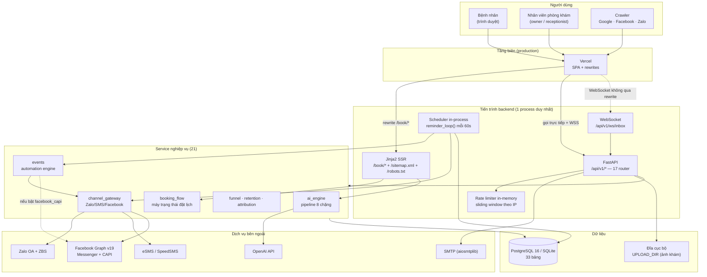
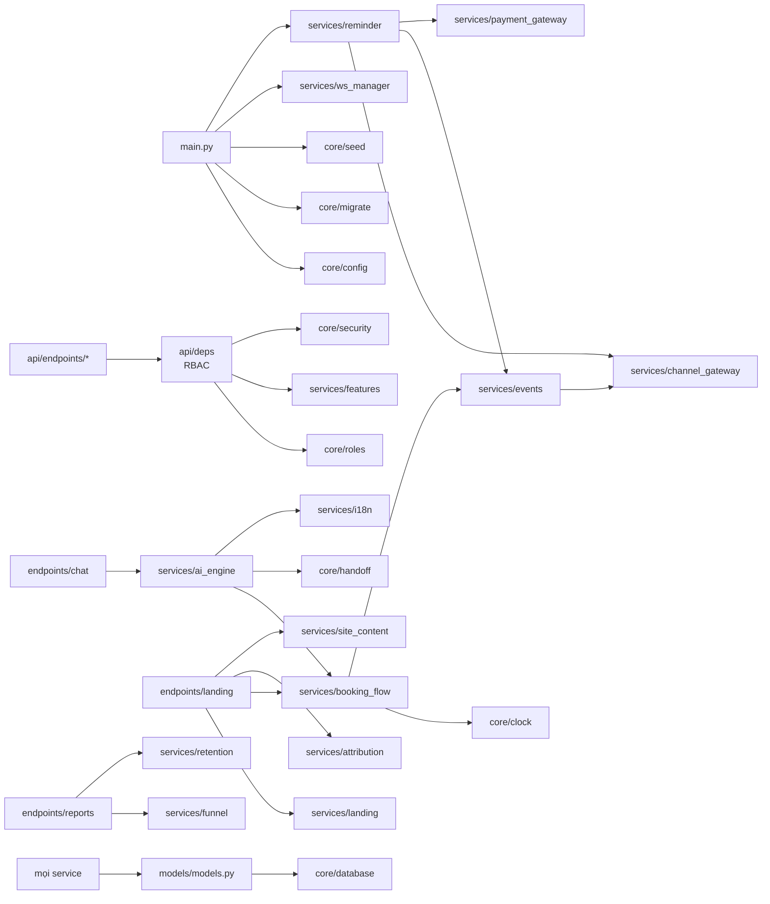
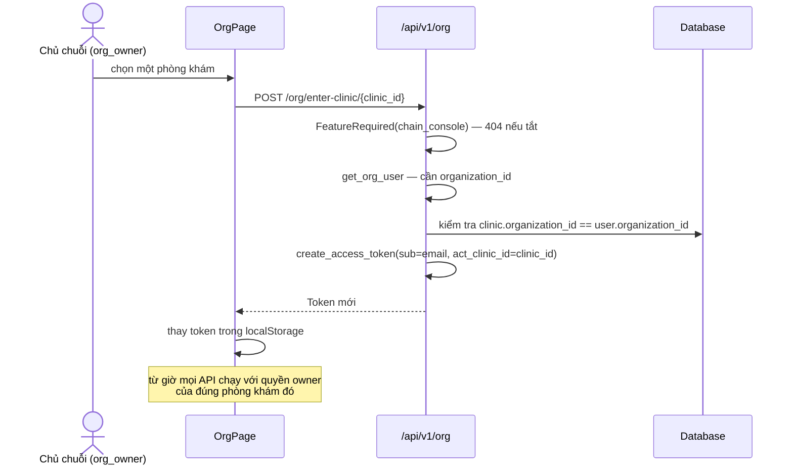
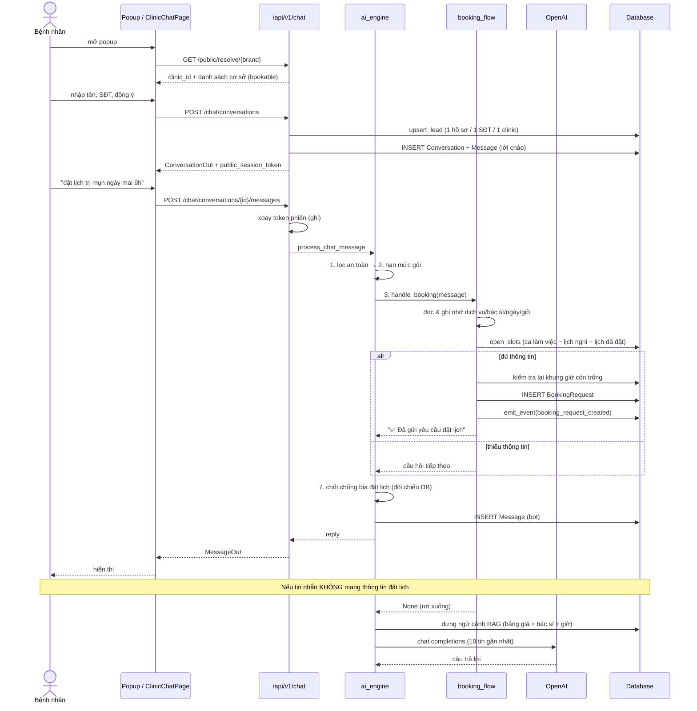
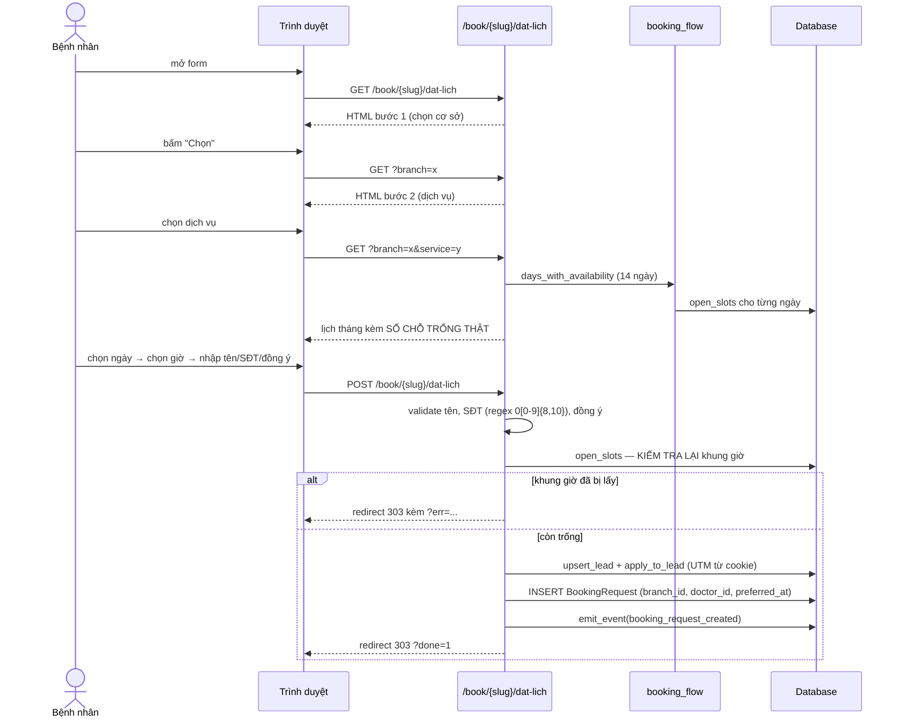
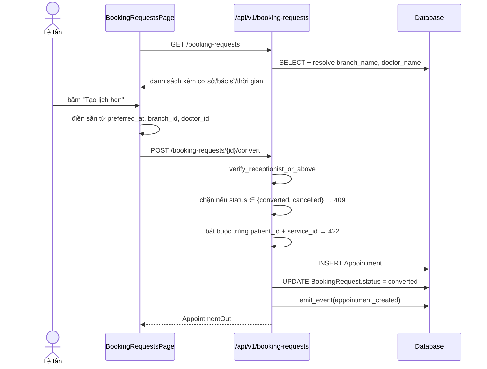
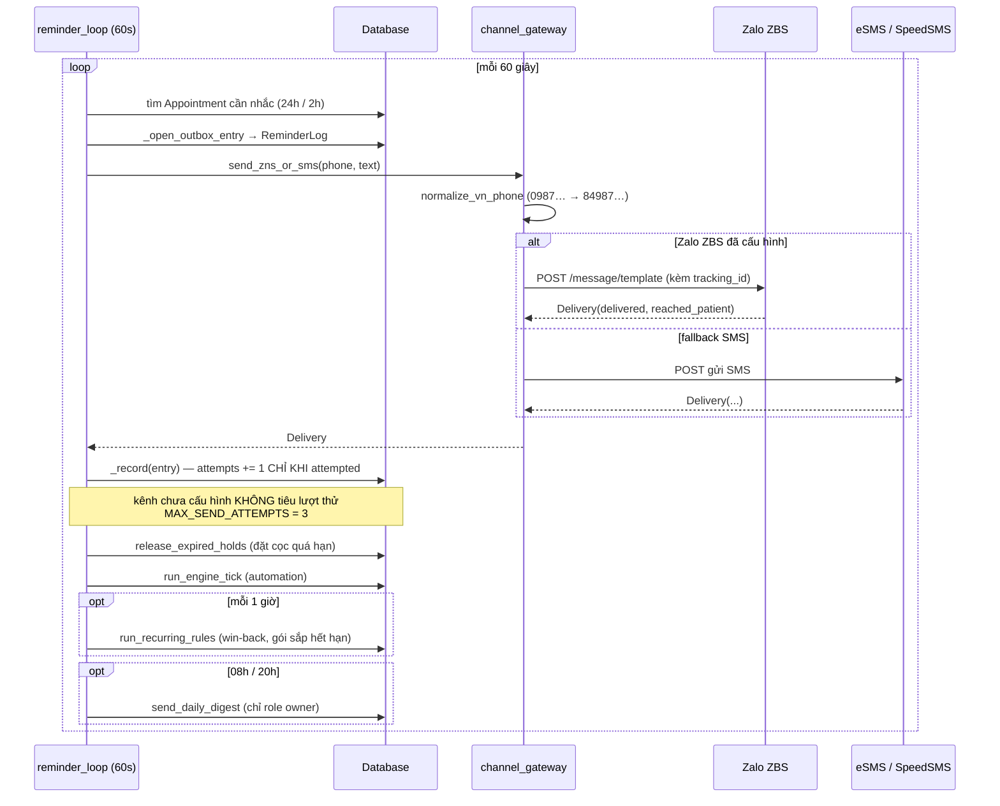
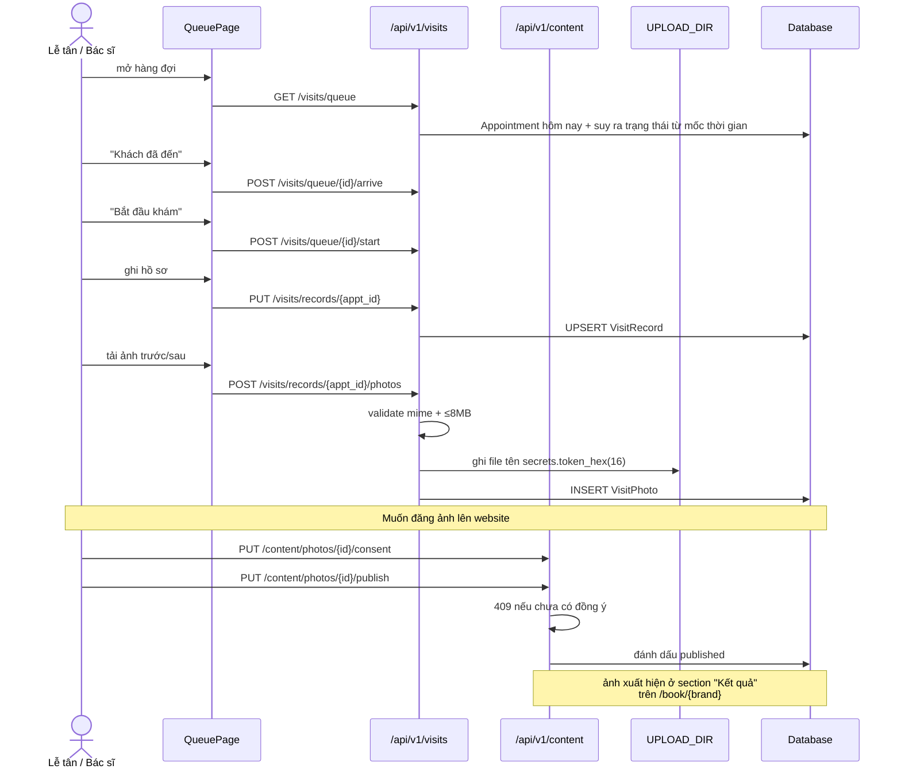

# CareDesk AI — System Architecture (As-Is)

> **Phạm vi.** Tài liệu mô tả hệ thống **đúng như source code hiện tại**, không đề xuất kiến trúc mới, không refactor.
> **Căn cứ.** Mọi kết luận đều dẫn file/path. Nội dung không xác nhận được từ source code được đánh dấu `Unconfirmed`.
> **Commit gốc.** `ae3d61f` trên nhánh `main` · 396 test pass · 123 route API · 33 bảng · 24 migration.
> **Ngày dựng.** 2026-08-30, đọc trực tiếp từ source (không dựa vào README).

---

## 1. System Overview

### 1.1 Mục đích hệ thống

Phần mềm vận hành (SaaS đa tenant) cho **phòng khám da liễu / thẩm mỹ da tại Việt Nam**. Ba việc chính:

1. **Thu hút** — landing page công khai do server render, tối ưu cho crawler Facebook/Zalo/Google.
2. **Chốt lịch** — trợ lý ảo AI + form đặt lịch không cần JavaScript, cả hai đều tạo `BookingRequest`.
3. **Vận hành & giữ khách** — hàng đợi khám, hồ sơ buổi khám, CRM, gói liệu trình, nhắc lịch tự động, báo cáo phễu doanh thu theo kênh.

Căn cứ: `backend/app/main.py:63` (description app), `TRIEN_KHAI.md`, `backend/app/templates/`, `backend/app/services/funnel.py`.

**Ranh giới nghiệp vụ cốt lõi:** khách công khai **chỉ tạo được `BookingRequest`** (yêu cầu), không bao giờ tạo `Appointment`. Chỉ nhân viên đã xác thực mới chuyển đổi. Căn cứ: `backend/app/api/endpoints/booking_requests.py` (`convert_booking_request`, phụ thuộc `verify_receptionist_or_above`), `backend/app/services/booking_flow.py` (chỉ tạo `BookingRequest`).

### 1.2 Các application / service chính

| # | Application | Loại | Vị trí | Ghi chú |
|---|---|---|---|---|
| 1 | **Backend API + SSR** | FastAPI (Python) | `backend/app/` | Một tiến trình duy nhất: REST API + landing SSR + WebSocket + scheduler nền |
| 2 | **Frontend quản trị** | React SPA | `frontend/src/` | Dùng sau đăng nhập |
| 3 | **Landing/Chat công khai** | Jinja2 SSR (trong backend) | `backend/app/templates/` | 5 template, phục vụ tại `/book/*` |
| 4 | **Widget nhúng** | JavaScript thuần | `widget/widget.js` | Script nhúng vào website bên ngoài |
| 5 | **Scripts vận hành** | Python CLI | `scripts/` | `backup.py`, `clinic_to_branch.py` |

> **Lưu ý:** không có microservice. Scheduler, rate limiter, WebSocket manager đều **chạy trong cùng tiến trình backend** và giữ state trong RAM. Căn cứ: `backend/app/main.py:96-115`.

### 1.3 Tech stack

| Lớp | Công nghệ | Căn cứ |
|---|---|---|
| Ngôn ngữ backend | Python 3.13 | `backend/Dockerfile:4` (`FROM python:3.13-slim`) |
| Web framework | FastAPI | `backend/app/main.py:5` |
| ASGI server | uvicorn (`--proxy-headers`) | `backend/Dockerfile:26-28` |
| ORM | SQLAlchemy 2.x | `backend/app/core/database.py`, `backend/app/models/models.py` |
| Migration | Alembic (24 revision) | `backend/alembic/versions/` |
| Config | pydantic-settings (Pydantic v2) | `backend/app/core/config.py:4` |
| Template SSR | Jinja2 | `backend/app/api/endpoints/landing.py:39` (`Jinja2Templates`) |
| Mật khẩu | bcrypt | `backend/app/core/security.py:3` |
| JWT | python-jose, HS256 | `backend/app/core/security.py:4,20` |
| HTTP client | httpx | `backend/app/services/channel_gateway.py`, `capi.py`, `webhooks.py` |
| Email | aiosmtplib | `backend/app/api/endpoints/appointment.py:6` |
| LLM SDK | openai | `backend/app/services/ai_engine.py:25` |
| Frontend | React 19 + Vite + react-router-dom 7 | `frontend/src/App.jsx:1`, `frontend/vite.config.js` |
| DB (dev) | SQLite | `backend/app/core/config.py:44` (mặc định `sqlite:///./caredesk.db`) |
| DB (prod) | PostgreSQL 16 | `render.yaml:47-49` |
| Test | pytest (396 test) | `pytest.ini`, `tests/` |

### 1.4 Cấu trúc repository

```
CareDesk-AI/
├── backend/
│   ├── Dockerfile                  # build từ repo root (app import chính nó là backend.app.*)
│   ├── requirements.txt
│   ├── alembic/versions/           # 24 migration
│   └── app/
│       ├── main.py                 # ENTRY POINT backend
│       ├── core/                   # 11 module hạ tầng
│       │   ├── config.py           # toàn bộ biến môi trường
│       │   ├── database.py         # engine + get_db
│       │   ├── security.py         # JWT + bcrypt
│       │   ├── roles.py            # từ vựng vai trò
│       │   ├── handoff.py          # lý do chuyển lễ tân
│       │   ├── clock.py            # đồng hồ múi giờ phòng khám
│       │   ├── booking_rules.py    # hằng số trạng thái giữ chỗ
│       │   ├── migrate.py          # alembic upgrade head lúc khởi động
│       │   ├── seed.py             # seed tài khoản + demo
│       │   ├── slug.py             # sinh/phân giải slug công khai
│       │   └── logging_config.py
│       ├── api/
│       │   ├── deps.py             # RBAC + FeatureRequired
│       │   └── endpoints/          # 19 module route
│       ├── models/models.py        # 33 bảng
│       ├── schemas/schemas.py      # Pydantic I/O
│       ├── services/               # 21 service nghiệp vụ
│       └── templates/              # 5 template Jinja2
├── frontend/
│   ├── Dockerfile, nginx.conf, vercel.json, vite.config.js
│   └── src/
│       ├── main.jsx                # ENTRY POINT frontend
│       ├── App.jsx                 # định tuyến
│       ├── api.js                  # API_BASE + WS_BASE + getAuthHeaders
│       ├── i18n.jsx
│       ├── components/             # Layout, AdminShell
│       └── pages/                  # 20 file page
├── tests/                          # 37 file test
├── scripts/                        # backup.py, clinic_to_branch.py
├── docs/                           # tài liệu này
├── docker-compose.yml, render.yaml, fly.toml
└── TRIEN_KHAI.md, README.md, HUONG_DAN_SU_DUNG.md, SO_TAY_VAN_HANH_PRODUCT.md
```

### 1.5 Entry point từng application

| Application | Entry point | Lệnh chạy | Căn cứ |
|---|---|---|---|
| Backend | `backend/app/main.py` → `app` | `python -m backend.app.main` (dev, có reload) hoặc `uvicorn backend.app.main:app` | `backend/app/main.py:194-197`, `backend/Dockerfile:26` |
| Frontend | `frontend/src/main.jsx` → `App.jsx` | `npm run dev` / `npm run build` | `frontend/vercel.json:4-5` |
| Landing SSR | `landing.router` mount tại `/book` | trong tiến trình backend | `backend/app/main.py:140` |
| SEO | `seo.router` mount tại root | trong tiến trình backend | `backend/app/main.py:144` |
| Scheduler | `reminder_loop()` qua `asyncio.create_task` | tự chạy lúc startup nếu `ENABLE_REMINDER_SCHEDULER=true` | `backend/app/main.py:114-115` |
| Backup CLI | `scripts/backup.py` | `python -m scripts.backup {dump\|list\|restore\|drill}` | `scripts/backup.py:1-13` |
| Migrate CLI | `scripts/clinic_to_branch.py` | chuyển Clinic thành Branch | `scripts/clinic_to_branch.py:1-8` |

---

## 2. System Architecture

### 2.1 Thành phần đã xác nhận

| Thành phần | Trạng thái | Chi tiết | Căn cứ |
|---|---|---|---|
| **Frontend** | ✅ Có | React 19 SPA, 18 trang, react-router-dom 7, `BrowserRouter` | `frontend/src/App.jsx` |
| **Backend** | ✅ Có | FastAPI, 19 router, 123 endpoint | `backend/app/main.py:119-144` |
| **Database** | ✅ Có | SQLAlchemy 2 + Alembic; SQLite dev / PostgreSQL 16 prod | `backend/app/core/config.py:44`, `render.yaml:47` |
| **Authentication** | ✅ Có | JWT HS256, bcrypt, OAuth2PasswordBearer | `backend/app/core/security.py`, `backend/app/api/deps.py` |
| **Authorization** | ✅ Có | 4 vai trò + `RoleChecker` + `FeatureRequired` + scoped token | `backend/app/api/deps.py:100-152` |
| **API** | ✅ Có | REST JSON dưới `/api/v1`, + SSR HTML tại `/book`, + WebSocket | `backend/app/main.py:119-144` |
| **Batch/Scheduler** | ✅ Có | `reminder_loop()` chạy mỗi 60s trong cùng tiến trình | `backend/app/services/reminder.py:257`, `config.py:REMINDER_CHECK_INTERVAL_SECONDS` |
| **Background job** | ✅ Có | automation engine tick + recurring rules (1h) + daily digest (08h/20h) | `backend/app/services/reminder.py:266-290` |
| **Cache** | ⚠️ Chỉ HTTP cache | **Không có Redis/Memcached.** Chỉ có `Cache-Control: public, max-age=300` trên landing brand/branch; form đặt lịch `no-store` | `backend/app/api/endpoints/landing.py:45,360,510,558` |
| **File Storage** | ⚠️ Đĩa cục bộ | `settings.UPLOAD_DIR` (mặc định `<repo>/uploads`); **ephemeral trên PaaS** (chính comment trong config cảnh báo) | `backend/app/core/config.py:UPLOAD_DIR`, `backend/app/api/endpoints/visits.py:45-46` |
| **Logging** | ⚠️ Cơ bản | `logging.basicConfig` INFO → stdout, `force=True` | `backend/app/core/logging_config.py` |
| **Monitoring/APM** | ❌ Không có | Không tìm thấy Sentry/Datadog/OpenTelemetry/Prometheus trong source | grep toàn repo |
| **Health check** | ✅ Có | `GET /health` — thực sự `SELECT 1` vào DB | `backend/app/main.py:184-192` |
| **External services** | ✅ Có | OpenAI, Zalo OA, Zalo ZBS, Facebook Messenger, Facebook CAPI, eSMS, SpeedSMS, SMTP | mục 9 |
| **AI/LLM** | ✅ Có | OpenAI SDK, model từ `LLM_MODEL` | `backend/app/services/ai_engine.py:22-28` |
| **Infrastructure** | ✅ Có config | Dockerfile ×2, docker-compose, render.yaml, fly.toml, vercel.json, nginx.conf | mục 10 |
| **CI/CD** | ❌ Không có | **Không có `.github/workflows/`** hay file CI nào | kiểm tra trực tiếp |

### 2.2 Mermaid — kiến trúc tổng thể



### 2.3 Dependency giữa các component



---

## 3. Functional Architecture

Nhóm theo domain. Mỗi chức năng ghi đủ: mục đích, vai trò, UI, FE component, API, service, model, external, permission, source file.

### Module A — Landing công khai & SEO

#### A1. Landing thương hiệu (brand)
- **Mục đích:** trang giới thiệu phòng khám/chuỗi cho bệnh nhân và crawler mạng xã hội.
- **User/Role:** công khai, không cần đăng nhập.
- **UI/Page:** `/book/{brand_slug}` — 9 section: triết lý, dịch vụ, bác sĩ, kết quả trước/sau, đánh giá, hành trình, không gian, cơ sở, khối chốt.
- **Frontend component:** không có (SSR thuần). Template `backend/app/templates/brand.html` kế thừa `base.html`.
- **Backend API:** `GET /book/{slug}` → `brand_landing`
- **Service:** `services/landing.py` (`load_brand`, `BrandView`), `services/site_content.py`, `services/attribution.py` (ghi cookie nguồn khách), `services/features.py` (cờ `multilang`)
- **Model:** `Clinic`, `Organization`, `Branch`, `Service`, `Doctor`, `SiteContent`, `VisitPhoto` (ảnh đã publish), `ReviewRequest` (đánh giá đã publish), `SlugRegistry`
- **External:** không
- **Permission:** công khai + `landing_rate_limiter` (120 req/phút/IP)
- **Source:** `backend/app/api/endpoints/landing.py:466-512`, `backend/app/services/landing.py`, `backend/app/templates/brand.html`

#### A2. Landing cơ sở (branch)
- **Mục đích:** trang riêng cho một địa điểm, hướng về chỉ đường + đặt lịch tại đó.
- **UI/Page:** `/book/{brand_slug}/{branch_slug}` — 4 section (dịch vụ, kết quả, cơ sở khác, khối chốt)
- **Backend API:** `GET /book/{brand_slug}/{branch_slug}` → `branch_landing`
- **Service:** `services/landing.py` (`load_branch`, `BranchView`)
- **Model:** như A1 + `Branch.latitude/longitude/map_url`
- **Source:** `backend/app/api/endpoints/landing.py:515-559`, `backend/app/templates/branch.html`

#### A3. Form đặt lịch không JavaScript
- **Mục đích:** đường đặt lịch cho bệnh nhân không chat được / không muốn chat.
- **UI/Page:** `/book/{brand}/dat-lich` — 5 bước (4 nếu 1 cơ sở): cơ sở → dịch vụ → ngày → giờ → thông tin liên hệ
- **Frontend component:** SSR, `booking.html`. Mỗi bước là link `?param=...#buoc-N` hoặc form POST.
- **Backend API:** `GET /book/{slug}/dat-lich` (`booking_form`), `POST /book/{slug}/dat-lich` (`booking_submit`)
- **Service:** `booking_flow.open_slots`, `booking_flow.days_with_availability`, `patients.upsert_lead`, `attribution.apply_to_lead`, `events.emit_event`
- **Model:** `BookingRequest`, `PatientLead`, `Service`, `Branch`, `Doctor`, `WorkingSchedule`, `DoctorTimeOff`, `Appointment` (đọc để tính chỗ trống)
- **Permission:** công khai + `landing_rate_limiter`; response `Cache-Control: no-store`
- **Source:** `backend/app/api/endpoints/landing.py:294-360` (GET), `363-462` (POST), `backend/app/templates/booking.html`

#### A4. Popup chat góc phải
- **Mục đích:** hỏi trợ lý ảo ngay trên trang đang đọc, không rời trang.
- **UI:** chèn vào mọi trang `/book/*` qua `` trong `base.html`
- **Backend API:** dùng `/api/v1/public/resolve/*` + `/api/v1/chat/*`
- **Permission:** công khai; progressive enhancement (không JS → link tới `/chat/{brand}` vẫn chạy)
- **Source:** `backend/app/templates/chat_popup.html`, `backend/app/templates/base.html:288`

#### A5. robots.txt & sitemap.xml
- **Mục đích:** SEO — sinh động theo các phòng khám đang bật landing.
- **Backend API:** `GET /robots.txt`, `GET /sitemap.xml`
- **Model:** `Clinic` (`landing_enabled`), `Branch`, `SlugRegistry`
- **Source:** `backend/app/api/endpoints/seo.py`

---

### Module B — Trợ lý ảo AI & Hộp thư

#### B1. Hội thoại công khai với AI
- **Mục đích:** tư vấn dịch vụ/giá/bác sĩ và dẫn tới đặt lịch.
- **User/Role:** bệnh nhân (công khai)
- **UI/Page:** `/chat/{brand}`, `/chat/{brand}/{branch}` (React `ClinicChatPage`), popup trên landing, widget nhúng
- **Frontend component:** `frontend/src/pages/ClinicChatPage.jsx`; `backend/app/templates/chat_popup.html`; `widget/widget.js`
- **Backend API:** `POST /api/v1/chat/conversations`, `POST /conversations/{id}/messages`, `GET /conversations/{id}/resume`, `GET /conversations/{id}/messages`
- **Service:** `ai_engine.process_chat_message` (pipeline 8 chặng), `booking_flow.handle_booking`, `public_chat_session`, `patients.upsert_lead`, `i18n`
- **Model:** `Conversation`, `Message`, `PublicChatSession`, `PatientLead`, `AISafetyRule`, `Clinic`
- **External:** OpenAI
- **Permission:** công khai nhưng **bắt buộc token phiên** (`X-CareDesk-Session`) trên mọi thao tác đọc/ghi hội thoại; `chat_rate_limiter` 30/phút/IP
- **Source:** `backend/app/api/endpoints/chat.py:52-300`, `backend/app/services/ai_engine.py:604-880`

#### B2. Nối lại hội thoại (resume)
- **Mục đích:** mở lại popup thì thấy đúng luồng cũ thay vì bị hỏi lại tên/SĐT.
- **Cơ chế:** gắn với **token trình duyệt giữ trong localStorage**, KHÔNG gắn với số điện thoại (số điện thoại không phải bí mật).
- **Giới hạn:** không nối lại hội thoại cũ hơn `PUBLIC_CHAT_RESUME_MAX_AGE_HOURS` (mặc định 72h) → HTTP 410. Trạng thái đặt lịch trỏ vào ngày đã qua bị xoá khi nối lại.
- **Backend API:** `GET /api/v1/chat/conversations/{id}/resume`
- **Source:** `backend/app/api/endpoints/chat.py:199-252`, `backend/app/templates/chat_popup.html` (hàm `resume()`), `frontend/src/pages/ClinicChatPage.jsx:65-85`

#### B3. Hộp thư AI cho nhân viên
- **Mục đích:** lễ tân theo dõi mọi hội thoại, tiếp quản khi cần.
- **User/Role:** `receptionist`, `owner`
- **UI/Page:** `/inbox` — 3 tab: Tất cả / Handoff / Lễ tân chat
- **Frontend component:** `frontend/src/pages/InboxPage.jsx`
- **Backend API:** `GET /api/v1/chat/conversations`, `GET /conversations/{id}`, `PUT /conversations/{id}/status`, `POST /conversations/{id}/agent-messages`
- **Service:** `ws_manager` (realtime), `channel_gateway.reply_to_conversation_channel`
- **Model:** `Conversation`, `Message`, `PatientLead`
- **Permission:** `verify_receptionist_or_above`
- **Source:** `backend/app/api/endpoints/chat.py:302-360`

#### B4. Chuyển lễ tân (handoff) có lý do
- **Mục đích:** quyết định trợ lý có được nói tiếp trong lúc chờ người thật hay không.
- **Cơ chế:** `Conversation.handoff_reason` lưu lý do. `MUTING_REASONS = {safety, quota, review_escalation}` → trợ lý im hoàn toàn. Các lý do khác (`model_unsure`, `phrase_match`, `fabricated_booking`, `llm_unavailable`) → vẫn trả lời tiếp.
- **Model:** `Conversation.status` (`bot_active | handoff_requested | agent_active`), `Conversation.handoff_reason`
- **Source:** `backend/app/core/handoff.py`, `backend/app/api/endpoints/chat.py:167-178`

#### B5. Xoá dữ liệu bệnh nhân (data erasure)
- **Mục đích:** đáp ứng yêu cầu xoá dữ liệu cá nhân.
- **Backend API:** `DELETE /api/v1/chat/conversations/{id}/data-erasure`
- **Permission:** `verify_owner`
- **Source:** `backend/app/api/endpoints/chat.py`

#### B6. Đánh giá chất lượng AI
- **Backend API:** `POST /api/v1/chat/evaluate-ai` · **Service:** `services/evaluator.py` · **Permission:** `verify_owner`

---

### Module C — Đặt lịch & Lịch hẹn

#### C1. Máy trạng thái đặt lịch trong chat
- **Mục đích:** thu thập dịch vụ/bác sĩ/ngày/giờ/tên/SĐT và tạo `BookingRequest`.
- **Cơ chế:** giữ `Conversation.booking_state` (JSON). Đọc **mọi** tin nhắn để ghi nhớ, nhưng chỉ kích hoạt khi có ý định đặt lịch.
- **Service:** `services/booking_flow.py` (`handle_booking`, `_resolve_service`, `_resolve_doctor`, `_parse_date`, `_parse_time`, `_parse_phone`, `_remember_details`, `open_slots`, `days_with_availability`)
- **Model:** `Conversation.booking_state`, `BookingRequest`, `WaitlistEntry`
- **Source:** `backend/app/services/booking_flow.py`

#### C2. Hộp yêu cầu đặt lịch (lễ tân)
- **UI/Page:** `/booking-requests` · **Component:** `BookingRequestsPage.jsx`
- **Backend API:** `GET /api/v1/booking-requests`, `PATCH /{id}`, `POST /{id}/convert`
- **Model:** `BookingRequest` (có `branch_id`, `doctor_id`, `preferred_at`), `Appointment`
- **Permission:** `verify_receptionist_or_above`
- **Source:** `backend/app/api/endpoints/booking_requests.py`

#### C3. Quản lý lịch hẹn
- **UI/Page:** `/appointments` · **Component:** `AppointmentsPage.jsx`
- **Backend API:** `GET/POST /api/v1/appointments`, `PUT /{id}`, `DELETE /{id}`, `POST /{id}/remind`, `GET /available-slots`
- **Service:** `ai_engine.get_available_slots`, `reminder.build_reminder_text`, `channel_gateway.send_zns_or_sms`, `payment_gateway.hold_for_deposit`
- **Model:** `Appointment` (20 cột, có `booking_requested_at/confirmed_at/cancelled_at/completed_at`), `ReminderLog`, `Payment`
- **Permission:** `verify_receptionist_or_above`; **xoá** cần `verify_owner`
- **Chống trùng chỗ:** chỉ mục duy nhất một phần trên slot (migration `d0e1f2a3b4c5`)
- **Source:** `backend/app/api/endpoints/appointment.py`

#### C4. Link công khai xác nhận / huỷ / đổi lịch
- **Mục đích:** bệnh nhân bấm một chạm từ tin nhắn nhắc lịch, không cần đăng nhập.
- **Backend API:** `GET /api/v1/public/appointments/{id}/confirm|cancel|reschedule`
- **Bảo vệ:** token HMAC theo `appointment_id` (`reminder.make_public_token` / `verify_public_token`)
- **Source:** `backend/app/api/endpoints/public.py`, `backend/app/services/reminder.py:25-35`

#### C5. Danh sách chờ (waitlist)
- **Backend API:** `GET/POST /api/v1/automations/waitlist`, `DELETE /waitlist/{id}`
- **Model:** `WaitlistEntry` · **Tự động:** `events._notify_waitlist` khi có chỗ trống

---

### Module D — Hàng đợi khám & Hồ sơ buổi khám

#### D1. Hàng đợi hôm nay
- **UI/Page:** `/queue` · **Component:** `QueuePage.jsx`
- **Backend API:** `GET /api/v1/visits/queue`, `POST /queue/{appt_id}/arrive`, `POST /queue/{appt_id}/start`
- **Cơ chế:** trạng thái hàng đợi suy ra từ mốc thời gian trên `Appointment`, không có cột trạng thái riêng
- **Permission:** `verify_receptionist_or_above`
- **Source:** `backend/app/api/endpoints/visits.py:86-160`

#### D2. Hồ sơ buổi khám
- **Backend API:** `GET/PUT /api/v1/visits/records/{appt_id}`, `GET /visits/patients/{patient_id}/history`
- **Model:** `VisitRecord` (13 cột, FK tới `Appointment`, `PatientLead`, `Doctor`, `User`)

#### D3. Ảnh trước/sau có kiểm soát đồng ý
- **Backend API:** `POST /visits/records/{appt_id}/photos`, `GET /visits/photos/{id}`, `DELETE /visits/photos/{id}`
- **Ràng buộc kỹ thuật:** chỉ `image/jpeg|png|webp`, tối đa **8MB**, tên file `secrets.token_hex(16)` (không suy ra được từ id bệnh nhân)
- **Ảnh chỉ phục vụ qua endpoint đã xác thực** (`FileResponse`), không phục vụ tĩnh
- **Đồng ý:** `VisitPhoto` có cột đồng ý riêng; publish lên website cần đồng ý trước (409 nếu chưa) — Nghị định 13/2023
- **Model:** `VisitPhoto` (17 cột)
- **Source:** `backend/app/api/endpoints/visits.py:40-46,290-380`, `backend/app/api/endpoints/content.py:127-210`

---

### Module E — CRM, Gói liệu trình, Thanh toán

#### E1. CRM khách hàng
- **UI/Page:** `/patients` · **Component:** `PatientsPage.jsx`
- **Backend API:** `GET/POST /api/v1/appointments/patients`, `GET/PUT /patients/{id}`
- **Service:** `services/patients.py` — `upsert_lead` gộp **một hồ sơ cho một số điện thoại trong một phòng khám**; tên mới ghi đè tên cũ
- **Model:** `PatientLead` (29 cột: nguồn khách, UTM first/latest touch, đồng ý dữ liệu, mã giới thiệu)
- **Source:** `backend/app/services/patients.py`, `backend/app/api/endpoints/appointment.py`

#### E2. Gói liệu trình
- **UI/Page:** `/packages` · **Component:** `PackagesPage.jsx`
- **Backend API:** `GET/POST /api/v1/packages`, `PUT/DELETE /{id}`, `POST /sell`, `GET /patient-packages`, `POST /patient-packages/{id}/use-session`
- **Model:** `ServicePackage`, `PatientPackage`
- **Permission:** đọc/bán `verify_receptionist_or_above`; tạo/sửa/xoá `verify_owner`

#### E3. Đặt cọc & thanh toán
- **Backend API:** `GET /api/v1/public/payments/{id}/pay` (trang QR), `POST /payments/{id}/confirm`
- **Service:** `payment_gateway.py` — `create_deposit_payment`, `hold_for_deposit`, `release_expired_holds`, `mark_paid`; token HMAC theo payment_id
- **Model:** `Payment` (`method` mặc định `mock_qr`)
- **External:** **Chưa tích hợp PSP thật.** Code ghi rõ "mock gateway; VNPay/MoMo adapter-ready" — `backend/app/api/endpoints/public.py:305`, `backend/app/models/models.py:688,697`
- **Giữ chỗ:** slot bị giữ `DEPOSIT_HOLD_MINUTES` (mặc định 15 phút) trong lúc chờ thanh toán; `release_expired_holds` chạy mỗi tick scheduler

---

### Module F — Nhắc lịch & Tự động hoá

#### F1. Nhắc lịch tự động
- **Cơ chế:** `check_and_send_reminders()` chạy mỗi 60s; gửi mốc 24h và 2h trước giờ hẹn
- **Outbox pattern:** `ReminderLog` lưu số lần thử (`MAX_SEND_ATTEMPTS = 3`), trạng thái, lỗi cuối. Kênh **chưa cấu hình** không tiêu tốn lượt thử.
- **Service:** `reminder.py` + `channel_gateway.send_zns_or_sms`
- **Model:** `ReminderLog`, `Appointment`
- **External:** Zalo ZBS → fallback SMS (eSMS/SpeedSMS)
- **Source:** `backend/app/services/reminder.py:93-206`

#### F2. Automation engine
- **Sự kiện kích hoạt:** `price_asked`, `booking_request_created`, `appointment_created`, `appointment_completed`, `appointment_cancelled`, `package_used_up`
- **Loại hành động:** `send_message`, `review_request`, `notify_waitlist`
- **Chu kỳ:** `run_engine_tick` mỗi 60s; `run_recurring_rules` mỗi 3600s (win-back, gói sắp hết hạn)
- **UI/Page:** `/automation` · **Component:** `AutomationPage.jsx`
- **Backend API:** `GET /api/v1/automations/rules`, `PUT /rules/{id}`, `GET /actions`, `GET /reviews`
- **Model:** `DomainEvent`, `AutomationRule`, `ScheduledAction`, `ReviewRequest`
- **Source:** `backend/app/services/events.py`

#### F3. Digest cho chủ phòng khám
- **Cơ chế:** `send_daily_digest()` lúc 08h và 20h (mỗi slot một lần), chỉ gửi cho `role == "owner"`
- **Source:** `backend/app/services/reminder.py:207-256`, `backend/app/core/roles.py` (giải thích vì sao `admin` bị gộp)

---

### Module G — Thiết lập phòng khám

| Chức năng | UI | API | Permission | Model |
|---|---|---|---|---|
| Hồ sơ phòng khám | `/clinic` `ClinicPage.jsx` | `GET /clinic`, `PUT /clinic/{id}` | đọc: mọi user · sửa: `verify_owner` | `Clinic` (28 cột) |
| Cơ sở (branch) | `/clinic` | `GET/POST /clinic/branches`, `PATCH/DELETE /branches/{id}` | đọc: receptionist+ · ghi: `verify_owner` | `Branch` |
| Dịch vụ & bảng giá | `/services` `ServicesPage.jsx` | `GET/POST /clinic/services`, `PUT/DELETE /services/{id}` | đọc: receptionist+ · ghi: `verify_owner` | `Service` (có `localized_content`) |
| Bác sĩ | `/doctors` `DoctorsPage.jsx` | `GET/POST /clinic/doctors`, `PUT/DELETE /doctors/{id}` | đọc: receptionist+ · ghi: `verify_owner` | `Doctor` |
| Ca làm việc | `/doctors` | `GET/POST /clinic/schedules`, `DELETE /schedules/{id}` | đọc: receptionist+ · ghi: `verify_owner` | `WorkingSchedule` |
| Ngày nghỉ | `/doctors` | `GET/POST /clinic/time-off`, `DELETE /time-off/{id}` | đọc: receptionist+ · ghi: `verify_owner` | `DoctorTimeOff` (`doctor_id` NULL = nghỉ cả phòng khám) |
| Cờ tính năng | `/settings` `SettingsPage.jsx` | `GET /clinic/features`, `PUT /features/{key}` | đọc: mọi user · ghi: `verify_owner` | `FeatureFlag` |
| Kênh Zalo/Facebook | `/settings` | `GET/POST /clinic/channels` | `verify_owner` | `ChannelIntegration` |
| Nhật ký kiểm toán | `/settings` | `GET /clinic/audit-logs` | `verify_owner` | `AuditLog` |
| Kiểm tra sẵn sàng | — | `GET /clinic/readiness` | `verify_receptionist_or_above` | tổng hợp |

**Ràng buộc ca làm việc:** `end_time` phải sau `start_time`; ca qua đêm bị từ chối HTTP 400 kèm hướng dẫn tách hai ca. Căn cứ: `backend/app/api/endpoints/clinic.py` (`create_schedule`).

---

### Module H — Website CMS

- **UI/Page:** `/website` · **Component:** `WebsitePage.jsx`
- **Backend API:** `GET/PUT /api/v1/content/site`, `GET /content/photos`, `PUT /photos/{id}/consent`, `PUT /photos/{id}/publish`, `GET /content/reviews`, `PUT /reviews/{id}/publish`
- **Service:** `services/site_content.py` — 19 `ContentKey` khai báo sẵn với giá trị mặc định tiếng Việt (template không bao giờ thấy ô trống)
- **Model:** `SiteContent`, `VisitPhoto`, `ReviewRequest`
- **Permission:** đọc `verify_receptionist_or_above` · ghi/publish `verify_owner`
- **Source:** `backend/app/api/endpoints/content.py`, `backend/app/services/site_content.py`

---

### Module I — Phân tích & Báo cáo

#### I1. Dashboard tổng quan doanh thu
- **UI/Page:** `/` · **Component:** `Dashboard.jsx` (khối con: `RevenueCard`, `BaselineCard`, `RetentionCard`, `GrowthOverview`, `CopilotBox`)
- **Backend API:** `GET /api/v1/reports/summary`, `GET /reports/funnel`
- **Service:** `services/funnel.py` (`build`, `confirmation_speed`, `ai_contribution`), `services/retention.py`, `services/attribution.py`
- **Model:** `PatientLead` (UTM), `BookingRequest`, `Appointment`, `RevenueRecord`, `Conversation`
- **Permission:** `verify_owner`
- **Quy tắc thống kê:** quy công cho **first touch**; mỗi bệnh nhân đếm **một lần**; tốc độ xác nhận dùng **trung vị** (không phải trung bình)
- **Source:** `backend/app/services/funnel.py:1-18` (nêu rõ 2 quy tắc), `frontend/src/pages/Dashboard.jsx`

#### I2. Báo cáo vận hành
- **UI/Page:** `/reports` · **Component:** `ReportsPage.jsx` · **API:** `GET /api/v1/reports/summary`

#### I3. Copilot cho nhân viên
- **API:** `POST /api/v1/copilot/ask` · **Permission:** `verify_receptionist_or_above` **+ cờ `copilot`** (router-level `FeatureRequired`)
- **Trạng thái:** cờ **tắt mặc định** → endpoint trả 404
- **Source:** `backend/app/api/endpoints/copilot.py:19`

---

### Module J — Đa tenant, Chuỗi, Nền tảng

#### J1. Console chuỗi
- **UI/Page:** `/org`, `/org/{slug}` · **Component:** `OrgPage.jsx`
- **API:** `GET /api/v1/org/me`, `GET /org/overview`, `POST /org/enter-clinic/{clinic_id}`
- **Permission:** `get_org_user` **+ cờ `chain_console`** (router-level) → tắt mặc định = 404
- **Cơ chế "bước vào phòng khám":** trả về JWT mới có claim `act_clinic_id`
- **Source:** `backend/app/api/endpoints/org.py:24`, `backend/app/api/deps.py:52-72`

#### J2. Quản trị nền tảng
- **UI/Page:** `/platform` · **Component:** `PlatformPage.jsx`
- **API:** `GET /platform/overview|clinics|plans|organizations`, `POST /clinics|plans|organizations`, `PATCH /clinics/{id}|plans/{id}|organizations/{id}`
- **Permission:** `get_platform_admin` (`User.is_platform_admin`)
- **Model:** `Clinic`, `Organization`, `Plan`, `User`
- **Service:** `services/tenant_stats.py`

#### J3. Onboarding
- **UI/Page:** `/onboarding` · **Component:** `OnboardingPage.jsx`
- **API:** `GET /api/v1/onboarding/status`, `PUT /baseline`, `POST /complete`
- **Permission:** `status` mọi user đã đăng nhập · `baseline`/`complete` `verify_owner`

---

### Module K — Kênh ngoài (Webhook)

- **API:** `GET/POST /api/v1/webhooks/zalo/{clinic_id}`, `GET/POST /webhooks/facebook/{clinic_id}`
- **GET** = verify challenge của nền tảng; **POST** = nhận tin nhắn (rate-limited `chat_rate_limiter`)
- **Service:** `ai_engine.process_chat_message`, `channel_gateway.send_zalo_message/send_facebook_message`
- **Model:** `ChannelIntegration`, `Conversation`, `Message`, `PatientLead`
- **Permission:** không có auth người dùng — bảo vệ bằng verify token của nền tảng
- **Đặc biệt:** Facebook webhook còn xử lý **bình luận** (auto-reply + ẩn comment) — `backend/app/api/endpoints/webhooks.py:179-190`

---

## 4. Screen / UI Map

### 4.1 Trang công khai (không đăng nhập)

| Route | Loại | Render bởi | Chức năng |
|---|---|---|---|
| `/book/{brand}` | SSR | `brand.html` | A1 — landing thương hiệu, 9 section |
| `/book/{brand}/{branch}` | SSR | `branch.html` | A2 — landing cơ sở |
| `/book/{brand}/dat-lich` | SSR | `booking.html` | A3 — form đặt lịch 5 bước |
| `/robots.txt`, `/sitemap.xml` | SSR | `seo.py` | A5 |
| `/chat/{brandSlug}` | SPA | `ClinicChatPage.jsx` | B1 — chat toàn trang |
| `/chat/{brandSlug}/{branchSlug}` | SPA | `ClinicChatPage.jsx` | B1 — chat ghim cơ sở |
| `/c/{slug}` | SPA (legacy) | `ClinicChatPage.jsx` | link cũ vẫn chạy |
| `/book/{orgSlug}/{clinicSlug}/chat` | SPA (legacy) | `ClinicChatPage.jsx` | link cũ vẫn chạy |
| `/g/{slug}` | Redirect | `ToLanding` | `window.location.replace('/book/{slug}')` |
| `/login` | SPA | `Login.jsx` | đăng nhập |
| `/register` | SPA | `RegisterPage.jsx` | đăng ký phòng khám (gói Free) |

### 4.2 Trang quản trị (trong `Layout`, cần token)

Sidebar chia **4 nhóm theo hành trình khách hàng**, không theo module kỹ thuật. Căn cứ: `frontend/src/components/Layout.jsx:73-90`.

| Nhóm | Route | Component | Chức năng |
|---|---|---|---|
| Thu hút & chốt khách | `/` | `Dashboard.jsx` | I1 |
| | `/inbox` | `InboxPage.jsx` | B3 |
| | `/booking-requests` | `BookingRequestsPage.jsx` | C2 |
| | `/appointments` | `AppointmentsPage.jsx` | C3 |
| | `/queue` | `QueuePage.jsx` | D1, D2, D3 |
| Giữ khách & tăng doanh thu | `/patients` | `PatientsPage.jsx` | E1 |
| | `/packages` | `PackagesPage.jsx` | E2 |
| | `/automation` | `AutomationPage.jsx` | F2 |
| Phân tích | `/reports` | `ReportsPage.jsx` | I2 |
| Hệ thống | `/onboarding` | `OnboardingPage.jsx` | J3 |
| | `/website` | `WebsitePage.jsx` | H |
| | `/clinic` | `ClinicPage.jsx` | G |
| | `/services` | `ServicesPage.jsx` | G |
| | `/doctors` | `DoctorsPage.jsx` | G |
| | `/settings` | `SettingsPage.jsx` | G |

### 4.3 Trang ngoài khung sidebar

| Route | Component | Gating |
|---|---|---|
| `/org`, `/org/{orgSlug}` | `OrgPage.jsx` | `ProtectedRoute` + cờ `chain_console` phía API |
| `/platform` | `PlatformPage.jsx` | `ProtectedRoute` + `is_platform_admin` phía API |
| `*` (fallback) | `Navigate to="/"` | — |

### 4.4 Component & Modal

| Component | Vai trò | File |
|---|---|---|
| `Layout` | Khung quản trị: sidebar 4 nhóm, header, avatar, chọn ngôn ngữ, đăng xuất | `frontend/src/components/Layout.jsx` |
| `AdminShell` | Vỏ trang admin | `frontend/src/components/AdminShell.jsx` |
| `ProtectedRoute` | Chặn khi không có `caredesk_token` trong localStorage | `frontend/src/App.jsx:33-39` |
| `ToLanding` | Redirect cứng ra khỏi SPA | `frontend/src/App.jsx:25-29` |
| `RevenueCard`, `BaselineCard`, `RetentionCard`, `GrowthOverview`, `CopilotBox` | Khối trên Dashboard | `frontend/src/pages/Dashboard.jsx:7,24,58,118,242` |
| Modal thêm ca làm việc | Dialog trong `DoctorsPage` | `frontend/src/pages/DoctorsPage.jsx:510-560` |
| Modal tạo lịch hẹn từ yêu cầu | Dialog trong `BookingRequestsPage` | `frontend/src/pages/BookingRequestsPage.jsx` (`openConvert`) |
| Popup chat | Panel góc phải trên landing | `backend/app/templates/chat_popup.html` |

> `Unconfirmed`: danh sách modal có thể chưa đầy đủ — một số dialog được render nội tuyến bằng state boolean trong từng page (ví dụ `showScheduleModal`) chứ không tách thành component riêng.

---

## 5. API Map

**Tổng: 123 route.** Base path `/api/v1` trừ khi ghi khác. Ký hiệu quyền:
`PUB` công khai · `SESS` cần token phiên chat · `RECP` `verify_receptionist_or_above` · `OWNER` `verify_owner` · `USER` `get_current_active_user` · `ORG` `get_org_user` + cờ `chain_console` · `PLAT` `get_platform_admin` · `FEAT` gated bởi cờ tính năng

### 5.1 `/auth` — Authentication (4)

| Method | Path | Purpose | Auth | Request | Response | Handler | Service | Model |
|---|---|---|---|---|---|---|---|---|
| POST | `/login` | Đăng nhập lấy JWT | PUB (rate-limited) | OAuth2 form (username=email, password) | `Token` | `login_access_token` | `security.create_access_token` | `User` |
| POST | `/register-clinic` | Tự đăng ký phòng khám + gói Free | PUB + `register_rate_limiter` (5/5ph) | JSON đăng ký | `Token` | `register_clinic` | `slug`, `seed_default_automations` | `User`,`Clinic`,`Plan` |
| GET | `/me` | Thông tin tài khoản hiện tại | USER | — | `UserOut` | `read_user_me` | — | `User` |
| POST | `/register-admin-only` | Tạo nhân viên trong phòng khám | USER (kiểm tra role trong hàm) | `UserCreate` | `UserOut` | `create_user_by_admin` | validate `CLINIC_ROLES` | `User` |

### 5.2 `/clinic` — Clinic Setup (26)

| Method | Path | Purpose | Auth | Response | Handler |
|---|---|---|---|---|---|
| GET | `` | Danh sách phòng khám trong phạm vi | USER | `List[ClinicOut]` | `get_clinics` |
| PUT | `/{clinic_id}` | Sửa hồ sơ phòng khám | OWNER | `ClinicOut` | `update_clinic` |
| GET | `/branches` | Danh sách cơ sở | RECP | `List[BranchOut]` | `get_branches` |
| POST | `/branches` | Tạo cơ sở | OWNER | `BranchOut` | `create_branch` |
| PATCH | `/branches/{id}` | Sửa cơ sở | OWNER | `BranchOut` | `update_branch` |
| DELETE | `/branches/{id}` | Xoá cơ sở | OWNER | — | `delete_branch` |
| GET | `/services` | Bảng giá | RECP | `List[ServiceOut]` | `get_services` |
| POST | `/services` | Thêm dịch vụ | OWNER | `ServiceOut` | `create_service` |
| PUT | `/services/{id}` | Sửa dịch vụ | OWNER | `ServiceOut` | `update_service` |
| DELETE | `/services/{id}` | Xoá dịch vụ | OWNER | — | `delete_service` |
| GET | `/doctors` | Danh sách bác sĩ | RECP | `List[DoctorOut]` | `get_doctors` |
| POST | `/doctors` | Thêm bác sĩ | OWNER | `DoctorOut` | `create_doctor` |
| PUT | `/doctors/{id}` | Sửa bác sĩ | OWNER | `DoctorOut` | `update_doctor` |
| DELETE | `/doctors/{id}` | Xoá bác sĩ | OWNER | — | `delete_doctor` |
| GET | `/schedules` | Ca làm việc | RECP | `List[WorkingScheduleOut]` | `get_schedules` |
| POST | `/schedules` | Thêm ca (từ chối ca qua đêm → 400) | OWNER | `WorkingScheduleOut` | `create_schedule` |
| DELETE | `/schedules/{id}` | Xoá ca | OWNER | — | `delete_schedule` |
| GET | `/time-off` | Danh sách nghỉ | USER | `List[TimeOffOut]` | `list_time_off` |
| POST | `/time-off` | Tạo lịch nghỉ (`doctor_id` NULL = cả phòng khám) | OWNER | `TimeOffOut` | `create_time_off` |
| DELETE | `/time-off/{id}` | Xoá lịch nghỉ | OWNER | — | `delete_time_off` |
| GET | `/features` | Trạng thái cờ tính năng | USER | dict | `get_features` |
| PUT | `/features/{key}` | Bật/tắt cờ | OWNER | dict | `set_feature` |
| GET | `/readiness` | Mức độ sẵn sàng vận hành | RECP | dict | `get_readiness` |
| GET | `/channels` | Cấu hình kênh | OWNER | `List[ChannelIntegrationOut]` | `get_channels` |
| POST | `/channels` | Lưu cấu hình kênh | OWNER | `ChannelIntegrationOut` | `upsert_channel` |
| GET | `/audit-logs` | Nhật ký thao tác | OWNER | list | `get_audit_logs` |

**Model liên quan:** `Clinic`, `Branch`, `Service`, `Doctor`, `WorkingSchedule`, `DoctorTimeOff`, `FeatureFlag`, `ChannelIntegration`, `AuditLog`.

### 5.3 `/appointments` — Appointment Engine (10)

| Method | Path | Purpose | Auth | Response | Handler |
|---|---|---|---|---|---|
| GET | `/patients` | Danh sách khách | RECP | `List[PatientLeadOut]` | `get_patients` |
| POST | `/patients` | Tạo khách | RECP | `PatientLeadOut` | `create_patient` |
| GET | `/patients/{id}` | Chi tiết khách | RECP | `PatientDetailOut` | `get_patient_detail` |
| PUT | `/patients/{id}` | Sửa khách | RECP | `PatientLeadOut` | `update_patient` |
| GET | `/available-slots` | Khung giờ trống | RECP | dict | `get_doctor_available_slots` |
| GET | `` | Danh sách lịch hẹn | RECP | `List[AppointmentOut]` | `get_appointments` |
| POST | `` | Tạo lịch hẹn | RECP | `AppointmentOut` | `create_appointment` |
| PUT | `/{id}` | Cập nhật (kèm mốc vòng đời) | RECP | `AppointmentOut` | `update_appointment` |
| POST | `/{id}/remind` | Gửi nhắc lịch thủ công | RECP | dict | `send_appointment_reminder` |
| DELETE | `/{id}` | Xoá lịch hẹn | **OWNER** | — | `delete_appointment` |

**Service:** `ai_engine.get_available_slots`, `reminder`, `channel_gateway`, `aiosmtplib` (email). **Model:** `Appointment`, `PatientLead`, `Doctor`, `Service`, `ReminderLog`.

### 5.4 `/chat` — AI & Inbox (10)

| Method | Path | Purpose | Auth | Response | Handler |
|---|---|---|---|---|---|
| POST | `/conversations` | Tạo hội thoại + lưu lời chào | PUB + rate limit | `ConversationOut` (có `public_session_token`) | `start_conversation` |
| POST | `/conversations/{id}/messages` | Bệnh nhân gửi tin (xoay token) | SESS | `MessageOut` | `send_message` |
| GET | `/conversations/{id}/resume` | Nối lại luồng (410 nếu quá cũ) | SESS | `{conversation_id,status,messages}` | `resume_conversation` |
| GET | `/conversations/{id}/messages` | Poll tin mới (`after_id`) | SESS | `List[MessageOut]` | `poll_messages` |
| POST | `/conversations/{id}/agent-messages` | Lễ tân trả lời | RECP | `MessageOut` | `send_agent_message` |
| GET | `/conversations` | Danh sách hội thoại (lọc `status`) | RECP | `List[ConversationOut]` | `list_conversations` |
| GET | `/conversations/{id}` | Chi tiết hội thoại | RECP | `ConversationOut` | `get_conversation_detail` |
| PUT | `/conversations/{id}/status` | Đổi trạng thái (tiếp quản) | RECP | `ConversationOut` | `update_conversation_status` |
| DELETE | `/conversations/{id}/data-erasure` | Xoá dữ liệu cá nhân | **OWNER** | — | `erase_patient_data` |
| POST | `/evaluate-ai` | Chấm chất lượng AI | **OWNER** | dict | `evaluate_ai_quality` |

### 5.5 `/booking-requests` (3)

| Method | Path | Purpose | Auth | Response | Handler |
|---|---|---|---|---|---|
| GET | `` | Hộp yêu cầu (kèm `branch_name`,`doctor_name`) | RECP | `List[BookingRequestOut]` | `list_booking_requests` |
| POST | `/{id}/convert` | Chuyển thành lịch hẹn | RECP | `AppointmentOut` | `convert_booking_request` |
| PATCH | `/{id}` | Đổi trạng thái | RECP | `BookingRequestOut` | `update_booking_request_status` |

### 5.6 `/visits` — Queue & Visit Records (9)

| Method | Path | Purpose | Auth | Response |
|---|---|---|---|---|
| GET | `/queue` | Hàng đợi hôm nay | RECP | `List[QueueEntry]` |
| POST | `/queue/{appt_id}/arrive` | Đánh dấu khách đã đến | RECP | dict |
| POST | `/queue/{appt_id}/start` | Bắt đầu khám | RECP | dict |
| GET | `/records/{appt_id}` | Hồ sơ buổi khám | RECP | `Optional[VisitRecordOut]` |
| PUT | `/records/{appt_id}` | Lưu hồ sơ | RECP | `VisitRecordOut` |
| GET | `/patients/{id}/history` | Lịch sử khám | RECP | `List[VisitRecordOut]` |
| POST | `/records/{appt_id}/photos` | Tải ảnh (≤8MB, jpeg/png/webp) | RECP | `VisitPhotoOut` |
| GET | `/photos/{id}` | Xem ảnh (FileResponse) | RECP | binary |
| DELETE | `/photos/{id}` | Xoá ảnh | RECP | — |

### 5.7 `/content` — Website Content (7)

| Method | Path | Purpose | Auth |
|---|---|---|---|
| GET | `/site` | Đọc 19 khối nội dung | RECP |
| PUT | `/site` | Sửa nội dung | OWNER |
| GET | `/photos` | Ảnh ứng viên đăng website | RECP |
| PUT | `/photos/{id}/consent` | Ghi nhận đồng ý của khách | OWNER |
| PUT | `/photos/{id}/publish` | Đăng ảnh (409 nếu chưa đồng ý) | OWNER |
| GET | `/reviews` | Danh sách đánh giá | RECP |
| PUT | `/reviews/{id}/publish` | Đăng đánh giá | OWNER |

### 5.8 `/packages` (7)

| Method | Path | Purpose | Auth | Response |
|---|---|---|---|---|
| GET | `` | Danh sách gói | RECP | `List[ServicePackageOut]` |
| POST | `` | Tạo gói | OWNER | `ServicePackageOut` |
| PUT | `/{id}` | Sửa gói | OWNER | `ServicePackageOut` |
| DELETE | `/{id}` | Xoá gói | OWNER | — |
| POST | `/sell` | Bán gói cho khách | RECP | dict |
| GET | `/patient-packages` | Gói khách đã mua | RECP | list |
| POST | `/patient-packages/{id}/use-session` | Trừ buổi | RECP | dict |

### 5.9 `/automations` (7)

| Method | Path | Purpose | Auth |
|---|---|---|---|
| GET | `/rules` | Danh sách quy tắc | RECP |
| PUT | `/rules/{id}` | Bật/tắt, sửa quy tắc | **OWNER** |
| GET | `/actions` | Hành động đã lên lịch gần đây | RECP |
| GET | `/reviews` | Yêu cầu đánh giá | RECP |
| GET | `/waitlist` | Danh sách chờ | RECP |
| POST | `/waitlist` | Thêm vào danh sách chờ | RECP |
| DELETE | `/waitlist/{id}` | Xoá khỏi danh sách chờ | RECP |

### 5.10 `/reports` (2)

| Method | Path | Purpose | Auth | Service |
|---|---|---|---|---|
| GET | `/summary` | Doanh thu, chuyển đổi, hiệu suất bác sĩ | **OWNER** | `funnel`, `retention` |
| GET | `/funnel` | Phễu theo kênh (first-touch) | **OWNER** | `funnel.build`, `confirmation_speed`, `ai_contribution` |

### 5.11 `/onboarding` (3)

| Method | Path | Purpose | Auth |
|---|---|---|---|
| GET | `/status` | Tiến độ thiết lập | USER |
| PUT | `/baseline` | Ghi số liệu nền | OWNER |
| POST | `/complete` | Hoàn tất onboarding | OWNER |

### 5.12 `/org` — Chain (3) · gated bởi cờ `chain_console`

| Method | Path | Purpose | Auth | Response |
|---|---|---|---|---|
| POST | `/enter-clinic/{clinic_id}` | Lấy JWT scoped `act_clinic_id` | ORG | `Token` |
| GET | `/me` | Thông tin chuỗi | ORG | dict |
| GET | `/overview` | Tổng quan các phòng khám | ORG | dict |

### 5.13 `/platform` — Super-admin (10)

| Method | Path | Purpose | Auth | Response |
|---|---|---|---|---|
| GET | `/overview` | Tổng quan nền tảng | PLAT | dict |
| GET | `/clinics` | Danh sách phòng khám | PLAT | list |
| POST | `/clinics` | Cấp phòng khám mới | PLAT | dict |
| PATCH | `/clinics/{id}` | Sửa/tạm ngưng phòng khám | PLAT | dict |
| GET | `/plans` | Gói cước | PLAT | `list[PlanOut]` |
| POST | `/plans` | Tạo gói cước | PLAT | `PlanOut` |
| PATCH | `/plans/{id}` | Sửa gói cước | PLAT | `PlanOut` |
| GET | `/organizations` | Danh sách chuỗi | PLAT | list |
| POST | `/organizations` | Tạo chuỗi | PLAT | `OrganizationOut` |
| PATCH | `/organizations/{id}` | Sửa chuỗi | PLAT | `OrganizationOut` |

### 5.14 `/public` — Public Links (10) · tất cả `public_rate_limiter` 10/phút

| Method | Path | Purpose | Auth | Response |
|---|---|---|---|---|
| GET | `/clinic-by-slug/{slug}` | Phân giải slug phòng khám | PUB | `PublicClinicOut` |
| GET | `/org/{org_slug}/clinics/{clinic_slug}` | Phân giải theo chuỗi | PUB | `PublicClinicOut` |
| GET | `/resolve/{brand_slug}` | Phân giải cho chat (kèm danh sách cơ sở + `bookable`) | PUB | `PublicClinicOut` |
| GET | `/resolve/{brand_slug}/{branch_slug}` | Như trên, ghim cơ sở | PUB | `PublicClinicOut` |
| GET | `/org-by-slug/{slug}` | Phân giải chuỗi | PUB | dict |
| GET | `/appointments/{id}/confirm` | Xác nhận lịch (token HMAC) | PUB + token | HTML |
| GET | `/appointments/{id}/cancel` | Huỷ lịch (token HMAC) | PUB + token | HTML |
| GET | `/appointments/{id}/reschedule` | Đổi lịch (token HMAC) | PUB + token | HTML |
| GET | `/payments/{id}/pay` | Trang thanh toán QR (mock) | PUB + token | HTML |
| POST | `/payments/{id}/confirm` | Xác nhận đã thanh toán | PUB + token | dict |

### 5.15 `/webhooks` (4) · `/ws` (1) · SEO (2) · `/book` (4) · gốc (2)

| Method | Path | Purpose | Auth |
|---|---|---|---|
| GET | `/api/v1/webhooks/zalo/{clinic_id}` | Verify challenge Zalo | Nền tảng |
| POST | `/api/v1/webhooks/zalo/{clinic_id}` | Nhận tin nhắn Zalo | Nền tảng + rate limit |
| GET | `/api/v1/webhooks/facebook/{clinic_id}` | Verify challenge Facebook | Nền tảng |
| POST | `/api/v1/webhooks/facebook/{clinic_id}` | Nhận tin nhắn + bình luận Facebook | Nền tảng + rate limit |
| WS | `/api/v1/ws/inbox` | Realtime hộp thư | `Unconfirmed` — cần đọc `ws.py` để xác nhận cơ chế xác thực |
| GET | `/robots.txt` | SEO | PUB |
| GET | `/sitemap.xml` | SEO | PUB |
| GET | `/book/{slug}` | Landing thương hiệu | PUB, cache 300s |
| GET | `/book/{brand}/{branch}` | Landing cơ sở | PUB, cache 300s |
| GET | `/book/{slug}/dat-lich` | Form đặt lịch | PUB, `no-store` |
| POST | `/book/{slug}/dat-lich` | Gửi yêu cầu đặt lịch | PUB |
| GET | `/` | Thông tin API | PUB |
| GET | `/health` | Liveness/readiness (`SELECT 1`) | PUB |

---

## 6. Data Architecture

### 6.1 Database

| Môi trường | Engine | Căn cứ |
|---|---|---|
| Development | SQLite, file neo về repo root qua `_absolutise_sqlite()` | `backend/app/core/config.py:20-36,44` |
| Production | PostgreSQL 16 (`plan: basic-256mb`) | `render.yaml:47-50` |
| Pool | `DB_POOL_SIZE=20`, `DB_MAX_OVERFLOW=20`, `DB_POOL_TIMEOUT=30` | `backend/app/core/config.py:56-58` |

**Migration:** Alembic, 24 revision, chạy tự động `alembic upgrade head` trong startup event (`core/migrate.py`, gọi tại `main.py:96`).

### 6.2 Bảng theo domain (33)

| Domain | Bảng |
|---|---|
| Tenant & quyền (8) | `organizations`, `clinics`, `branches`, `users`, `plans`, `slug_registry`, `feature_flags`, `audit_logs` |
| Dịch vụ & nhân sự (5) | `services`, `doctors`, `working_schedules`, `doctor_time_off`, `service_packages` |
| Khách & hội thoại (5) | `patient_leads`, `conversations`, `messages`, `public_chat_sessions`, `ai_safety_rules` |
| Đặt lịch & khám (5) | `booking_requests`, `appointments`, `waitlist_entries`, `visit_records`, `visit_photos` |
| Tiền (3) | `revenue_records`, `payments`, `patient_packages` |
| Vận hành & tự động (6) | `reminder_logs`, `domain_events`, `automation_rules`, `scheduled_actions`, `review_requests`, `channel_integrations` |
| Website (1) | `site_content` |

### 6.3 Mermaid ER (quan hệ xác nhận từ ForeignKey)

```mermaid
erDiagram
    organizations ||--o{ clinics : "có"
    organizations ||--o{ users : "org_owner thuộc"
    plans ||--o{ clinics : "gói cước"
    clinics ||--o{ branches : "cơ sở"
    clinics ||--o{ users : "nhân viên"
    clinics ||--o{ services : "dịch vụ"
    clinics ||--o{ doctors : "bác sĩ"
    clinics ||--o{ patient_leads : "khách"
    clinics ||--o{ conversations : ""
    clinics ||--o{ appointments : ""
    clinics ||--o{ booking_requests : ""
    clinics ||--o{ feature_flags : ""
    clinics ||--o{ channel_integrations : ""
    clinics ||--o{ ai_safety_rules : ""
    clinics ||--o{ automation_rules : ""
    clinics ||--o{ site_content : ""
    clinics ||--o{ service_packages : ""

    branches ||--o{ doctors : "trực thuộc"
    branches ||--o{ working_schedules : ""
    branches ||--o{ conversations : "ghim cơ sở"
    branches ||--o{ appointments : ""
    branches ||--o{ booking_requests : ""

    doctors ||--o{ working_schedules : "ca làm việc"
    doctors ||--o{ doctor_time_off : "nghỉ"
    doctors ||--o{ appointments : ""
    doctors ||--o{ booking_requests : ""
    doctors ||--o{ visit_records : ""
    doctors ||--o| users : "liên kết tài khoản"

    patient_leads ||--o{ conversations : ""
    patient_leads ||--o{ appointments : ""
    patient_leads ||--o{ booking_requests : ""
    patient_leads ||--o{ patient_packages : ""
    patient_leads ||--o{ payments : ""
    patient_leads ||--o{ revenue_records : ""
    patient_leads ||--o{ review_requests : ""
    patient_leads ||--o{ waitlist_entries : ""
    patient_leads ||--o{ domain_events : ""
    patient_leads ||--o{ scheduled_actions : ""
    patient_leads ||--o{ visit_records : ""
    patient_leads ||--o| patient_leads : "referred_by"

    conversations ||--o{ messages : ""
    conversations ||--o{ public_chat_sessions : "token phiên"
    conversations ||--o{ appointments : ""
    conversations ||--o{ booking_requests : ""

    appointments ||--o{ reminder_logs : "outbox nhắc lịch"
    appointments ||--o{ payments : ""
    appointments ||--o{ revenue_records : ""
    appointments ||--o{ review_requests : ""
    appointments ||--o| visit_records : ""

    visit_records ||--o{ visit_photos : "ảnh trước/sau"
    services ||--o{ service_packages : ""
    services ||--o{ appointments : ""
    services ||--o{ booking_requests : ""
    services ||--o{ waitlist_entries : ""
    service_packages ||--o{ patient_packages : ""
    patient_packages ||--o{ revenue_records : ""
    automation_rules ||--o{ scheduled_actions : ""
    users ||--o{ audit_logs : ""
    users ||--o{ visit_records : "created_by"
    users ||--o{ visit_photos : "uploaded_by / consent_by"
    users ||--o{ site_content : "updated_by"
```



### 6.4 Dữ liệu quan trọng nằm ở đâu

| Dữ liệu | Bảng/cột | Ghi chú |
|---|---|---|
| Mật khẩu nhân viên | `users.password_hash` | bcrypt, không lưu plaintext |
| Token phiên chat công khai | `public_chat_sessions.token_hash` | **SHA-256 hash**, không lưu token gốc |
| Đồng ý dữ liệu bệnh nhân | `patient_leads.consent_given`, `consent_timestamp` | |
| Đồng ý dùng ảnh | `visit_photos` (cột đồng ý riêng) | tách khỏi đồng ý dữ liệu chung |
| Nguồn khách (attribution) | `patient_leads`: `utm_*`, `click_id`, `latest_utm_*`, `first_seen_at`, `latest_touch_at`, `touch_count` | first-touch bất biến |
| Trạng thái đặt lịch đang dở | `conversations.booking_state` (JSON) | |
| Lý do chuyển lễ tân | `conversations.handoff_reason` | quyết định trợ lý có im hay không |
| Hàng đợi gửi tin | `reminder_logs`: `attempts`, `status`, `last_error` | outbox pattern |
| File ảnh | **Ngoài DB** — đĩa `UPLOAD_DIR`; DB chỉ lưu tên file | ephemeral trên PaaS |
| Bí mật kênh Zalo/FB | `channel_integrations.access_token`, `extra_config` | `Unconfirmed`: không thấy mã hoá ở tầng ứng dụng |

---

## 7. Authentication & Authorization

### 7.1 Cơ chế xác thực

| Thuộc tính | Giá trị | Căn cứ |
|---|---|---|
| Kiểu | JWT Bearer (OAuth2 password flow) | `backend/app/api/deps.py:19` |
| Thuật toán | HS256 | `backend/app/core/config.py:ALGORITHM` |
| Khoá ký | `SECRET_KEY` (hard-fail nếu còn mặc định ở production) | `backend/app/main.py:32-36` |
| Hạn token | **7 ngày** (`60*24*7` phút) | `backend/app/core/config.py:ACCESS_TOKEN_EXPIRE_MINUTES` |
| Subject | email người dùng | `backend/app/core/security.py:15` |
| Claim mở rộng | `act_clinic_id` (bước vào phòng khám) | `backend/app/core/security.py:16-17` |
| Hash mật khẩu | bcrypt (`gensalt` + `hashpw`) | `backend/app/core/security.py:23-33` |
| Lưu token ở client | `localStorage['caredesk_token']` | `frontend/src/api.js:8-14` |
| Refresh token | **Không có** | không tìm thấy trong source |
| SSO / SAML / OAuth bên thứ ba | **Không có** | không tìm thấy trong source |

### 7.2 Xác thực khách công khai (chat)

Cơ chế **riêng biệt**, không dùng JWT:

| Thuộc tính | Giá trị | Căn cứ |
|---|---|---|
| Loại | Token mờ (opaque), `secrets.token_urlsafe(32)` | `backend/app/services/public_chat_session.py` |
| Lưu trữ | Chỉ lưu SHA-256 hash trong `public_chat_sessions` | cùng file |
| Header | `X-CareDesk-Session` | `backend/app/api/endpoints/chat.py` |
| TTL | `PUBLIC_CHAT_SESSION_TTL_SECONDS` mặc định 24h, gia hạn mỗi lần dùng | `config.py` |
| Xoay vòng | **Chỉ khi ghi** (POST message). Đọc không xoay — tránh đua giữa polling 4s và send chậm | `public_chat_session.py:63-101` |
| Ân hạn token cũ | 30 giây | cùng file |
| Bắt buộc | **Luôn luôn** — không còn cờ bật/tắt | `backend/app/api/endpoints/chat.py:34-48` |

### 7.3 Phân quyền

**4 vai trò** (`backend/app/core/roles.py`):

| Vai trò | `clinic_id` | Phạm vi |
|---|---|---|
| `owner` | có | Toàn quyền trong một phòng khám |
| `receptionist` | có | Vận hành, không sửa cấu hình/giá/nhân sự |
| `org_owner` | NULL | Cả chuỗi; vào phòng khám qua scoped token |
| `platform` | NULL | Xuyên tenant (kèm `is_platform_admin`) |

**Các lớp kiểm tra** (`backend/app/api/deps.py`):

1. `get_current_user` — giải mã JWT, nạp user, áp `act_clinic_id` nếu có (validate clinic thuộc org **hoặc** là platform admin; `db.expunge` để override không bao giờ ghi xuống DB).
2. `get_current_active_user` — chặn user `is_active=False`; chặn nhân viên của phòng khám bị tạm ngưng (platform admin miễn trừ).
3. `RoleChecker` — `verify_owner`, `verify_receptionist_or_above`.
4. `get_platform_admin`, `get_org_user`.
5. `FeatureRequired` — trả **404** (không phải 403) khi cờ tắt.

### 7.4 Sequence diagram — đăng nhập & gọi API

```mermaid
sequenceDiagram
    actor U as Nhân viên
    participant FE as React SPA
    participant API as FastAPI /auth/login
    participant SEC as core/security
    participant DB as Database

    U->>FE: nhập email + mật khẩu
    FE->>API: POST /api/v1/auth/login (form)
    API->>DB: SELECT user WHERE email
    DB-->>API: User (password_hash)
    API->>SEC: verify_password(plain, hash)
    SEC-->>API: True
    API->>SEC: create_access_token(sub=email, exp=7 ngày)
    SEC-->>API: JWT
    API-->>FE: {access_token, token_type}
    FE->>FE: localStorage['caredesk_token'] = JWT

    Note over FE,DB: Mọi request sau đó
    FE->>API: GET /api/v1/... (Authorization: Bearer JWT)
    API->>SEC: jwt.decode(SECRET_KEY, HS256)
    SEC-->>API: {sub, exp, act_clinic_id?}
    API->>DB: SELECT user WHERE email = sub
    alt có act_clinic_id
        API->>DB: SELECT clinic WHERE id = act_clinic_id
        API->>API: validate clinic thuộc org / platform admin
        API->>API: db.expunge(user); user.clinic_id = clinic.id
        API->>API: nếu role ∈ ABOVE_CLINIC_ROLES → map thành owner
    end
    API->>API: get_current_active_user (is_active + clinic còn hoạt động)
    API->>API: RoleChecker / FeatureRequired
    API-->>FE: dữ liệu hoặc 401/403/404
```

### 7.5 Sequence diagram — "bước vào phòng khám" (chain)



---

## 8. Major Business Flows

### 8.1 Đặt lịch qua chat AI



### 8.2 Đặt lịch qua form không JavaScript



### 8.3 Lễ tân chuyển yêu cầu thành lịch hẹn



### 8.4 Nhắc lịch tự động (scheduler)



### 8.5 Hàng đợi khám → hồ sơ → ảnh → website



---

## 9. External Integrations

| # | Dịch vụ | Mục đích | Component | Endpoint | Authentication | Config |
|---|---|---|---|---|---|---|
| 1 | **OpenAI** | Sinh câu trả lời tư vấn | `services/ai_engine.py` | SDK `chat.completions.create` | `OPENAI_API_KEY` | `LLM_MODEL` (mặc định `gpt-5.6-terra`), `temperature=0.2`, `max_tokens=500` |
| 2 | **Zalo OA** | Trả lời tin nhắn Zalo | `channel_gateway.send_zalo_message` | `POST https://openapi.zalo.me/v3.0/oa/message/cs` | header `access_token` từ `ChannelIntegration` | `ChannelIntegration(channel="zalo")` |
| 3 | **Zalo ZBS Template** | Nhắc lịch có mẫu duyệt | `channel_gateway` (`send_zns_or_sms`) | `POST https://business.openapi.zalo.me/message/template` | `access_token` | `extra_config` (khoá vẫn tên `zns_*` vì tương thích ngược) |
| 4 | **Facebook Messenger** | Trả lời tin nhắn Page | `channel_gateway.send_facebook_message`, `webhooks.py` | `POST https://graph.facebook.com/v19.0/me/messages` | page access token | `ChannelIntegration(channel="facebook")` |
| 5 | **Facebook Comments** | Auto-reply + ẩn bình luận | `endpoints/webhooks.py:179-190` | `POST .../{comment_id}/comments`, `POST .../{comment_id}` | page access token | như trên |
| 6 | **Facebook CAPI** | Gửi sự kiện chuyển đổi | `services/capi.py:42` | `POST https://graph.facebook.com/v19.0/{pixel_id}/events` | pixel token | cờ `facebook_capi` (**tắt mặc định**) |
| 7 | **eSMS** | SMS nhắc lịch (VN) | `channel_gateway._send_esms` | `POST https://rest.esms.vn/MainService.svc/json/SendMultipleMessage_V4_post_json/` | `SMS_API_KEY` + `SMS_SECRET_KEY` | `SMS_BRANDNAME`, `SMS_SANDBOX` |
| 8 | **SpeedSMS** | SMS thay thế | `channel_gateway._send_speedsms` | `POST https://api.speedsms.vn/index.php/sms/send` | `SMS_API_KEY` | không có sandbox xác nhận |
| 9 | **SMTP** | Email nhắc lịch | `endpoints/appointment.py:122` (aiosmtplib) | `SMTP_HOST:SMTP_PORT` | `SMTP_USER` / `SMTP_PASSWORD` | `EMAILS_FROM_EMAIL`, `EMAILS_FROM_NAME` |
| 10 | **Cổng thanh toán** | Đặt cọc | `services/payment_gateway.py` | — | token HMAC nội bộ | **Chưa tích hợp PSP thật** — mock QR, ghi rõ "VNPay/MoMo adapter-ready" |

### 9.1 Ba môi trường gửi tin nhắn

`SMS_PROVIDER` là **cấu hình triển khai**, không phải cờ tính năng theo phòng khám — một phòng khám không được tự chuyển mình sang sandbox rồi ngừng tiếp cận bệnh nhân của chính họ. Căn cứ: `backend/app/core/config.py` (comment tại `SMS_PROVIDER`).

| Giá trị | Hành vi |
|---|---|
| `mock` | Ghi log, không gửi — dev |
| `esms` + `SMS_SANDBOX=true` | Gọi API thật, credential thật, không tính phí, không giao — staging |
| `esms` / `speedsms` | Gửi thật |
| rỗng | **Không gửi gì**, và hệ thống **báo rõ "chưa gửi được"** thay vì giả vờ đã gửi |

Production **hard-fail lúc khởi động** nếu `SMS_PROVIDER=mock` hoặc `SMS_SANDBOX=true`. Căn cứ: `backend/app/main.py:38-46`.

### 9.2 Cảnh báo còn tồn tại trong code

`backend/app/services/channel_gateway.py:27-34` ghi nguyên văn: *"VERIFY THIS ENDPOINT against the current Zalo docs before connecting the first real OA"* — endpoint ZBS Template chưa được kiểm chứng với OA thật. → `Unconfirmed`.

---

## 10. Configuration & Deployment

### 10.1 Biến môi trường (nguồn: `backend/app/core/config.py`)

| Biến | Mặc định | Ý nghĩa |
|---|---|---|
| `ENVIRONMENT` | `development` | Gate seed demo + 4 kiểm tra hard-fail |
| `DATABASE_URL` | `sqlite:///./caredesk.db` | SQLite path được neo về repo root |
| `DB_POOL_SIZE` / `DB_MAX_OVERFLOW` / `DB_POOL_TIMEOUT` | 20 / 20 / 30 | Pool (mặc định thư viện quá nhỏ, đã nghẽn ở 100 request đồng thời) |
| `SECRET_KEY` | placeholder | **Hard-fail ở production nếu còn mặc định** |
| `OPENAI_API_KEY` | rỗng | Rỗng → chạy bộ dò từ khoá |
| `LLM_MODEL` | `gpt-5.6-terra` | |
| `SMTP_HOST/PORT/USER/PASSWORD` | gmail:587 | Email nhắc lịch |
| `EMAILS_FROM_EMAIL/NAME` | `no-reply@caredesk.ai` | |
| `BACKEND_CORS_ORIGINS` | `localhost:5173,127.0.0.1:5173` | **`*` bị từ chối ở production** |
| `PLAN_FREE_QUOTA` / `PLAN_PRO_QUOTA` | 200 / 5000 | Số lượt bot trả lời/tháng |
| `ENABLE_REMINDER_SCHEDULER` | `true` | |
| `REMINDER_CHECK_INTERVAL_SECONDS` | 60 | |
| `PUBLIC_BASE_URL` | `http://localhost:8000` | **Hard-fail ở production nếu còn localhost** — canonical/og:url/sitemap đều dựng từ đây |
| `FRONTEND_BASE_URL` | tự suy ra (`:5173` ở dev) | Link `/chat/*` từ landing |
| `UPLOAD_DIR` | `<repo>/uploads` | **Ephemeral trên PaaS** |
| `DEPOSIT_HOLD_MINUTES` | 15 | Thời gian giữ chỗ chờ cọc |
| `SMS_PROVIDER` / `SMS_API_KEY` / `SMS_SECRET_KEY` / `SMS_BRANDNAME` / `SMS_SANDBOX` | rỗng / false | Xem 9.1 |
| `RATE_LIMIT_PER_MINUTE` | 30 | |
| `PUBLIC_CHAT_SESSION_TTL_SECONDS` | 86400 | |
| `PUBLIC_CHAT_RESUME_MAX_AGE_HOURS` | 72 | |
| `SEED_DEMO_DATA` | dev=true, prod=false | |
| `PLATFORM_ADMIN_EMAIL` / `PLATFORM_ADMIN_PASSWORD` | rỗng | Rỗng ở prod → sinh mật khẩu ngẫu nhiên, **log một lần duy nhất** |
| `WEB_CONCURRENCY` | — | >1 sẽ log cảnh báo (scheduler + rate limiter nhân bản) |
| `VITE_API_URL` (frontend) | `http://localhost:8000` | **Nhúng lúc build**, đổi phải redeploy |

### 10.2 Kiểm tra hard-fail lúc khởi động (production)

Bốn kiểm tra chạy **ở thời điểm import**, trước cả khi app được tạo (`backend/app/main.py:27-56`):

1. `BACKEND_CORS_ORIGINS` chứa `*` → `RuntimeError`
2. `SECRET_KEY` còn chứa `SUPER_SECRET_KEY` → `RuntimeError`
3. `SMS_PROVIDER=mock` hoặc `SMS_SANDBOX=true` → `RuntimeError`
4. `PUBLIC_BASE_URL` chứa `localhost` → `RuntimeError`

### 10.3 File cấu hình hạ tầng

| File | Nội dung |
|---|---|
| `backend/Dockerfile` | python:3.13-slim; build từ **repo root**; `--proxy-headers --forwarded-allow-ips='*'` (bắt buộc sau reverse proxy, nếu không rate limiter coi mọi bệnh nhân là một IP) |
| `frontend/Dockerfile` + `frontend/nginx.conf` | Build SPA, phục vụ qua nginx |
| `docker-compose.yml` | Chạy toàn bộ stack cục bộ |
| `render.yaml` | Blueprint: web service (docker) + PostgreSQL 16; `SECRET_KEY` sinh tự động; `WEB_CONCURRENCY=1`; `healthCheckPath: /health`; plan `starter` |
| `fly.toml` | App `caredesk-api`, region `sin` (Singapore); `auto_stop_machines=false`, `min_machines_running=1` để scheduler luôn sống |
| `frontend/vercel.json` | Rewrite `/book/*`, `/sitemap.xml`, `/robots.txt` sang backend; SPA fallback; cache `assets/*` 1 năm. **Còn placeholder `REPLACE-WITH-BACKEND-HOST`** |
| `frontend/vite.config.js` | Dev proxy `/book`, `/sitemap.xml`, `/robots.txt` → `localhost:8000` |
| `pytest.ini` | Cấu hình test |

### 10.4 Kiến trúc triển khai đã chọn

Frontend **Vercel** + backend **container riêng** (Render/Railway/Fly) + **PostgreSQL**. Landing `/book/*` **phải đi qua domain Vercel** vì canonical/og:url/sitemap dựng từ `PUBLIC_BASE_URL`; API và WebSocket **gọi thẳng** backend (Vercel rewrite không giữ được WebSocket lâu dài). Căn cứ: `TRIEN_KHAI.md`.

### 10.5 Khác biệt Development / Staging / Production

| Khía cạnh | Development | Staging | Production |
|---|---|---|---|
| DB | SQLite file | `Unconfirmed` | PostgreSQL 16 |
| Seed demo | Bật | `Unconfirmed` | **Tắt** |
| SMS | `mock` | `esms` + `SMS_SANDBOX=true` | Nhà cung cấp thật (mock/sandbox bị **chặn khởi động**) |
| CORS | localhost:5173 | `Unconfirmed` | Origin tường minh, `*` bị chặn |
| SECRET_KEY | placeholder (chỉ cảnh báo) | `Unconfirmed` | Bắt buộc thật |
| Reload uvicorn | Có | — | Không |
| Worker | 1 | 1 | 1 (`WEB_CONCURRENCY=1`) |

> `Unconfirmed`: repository **không có** file cấu hình staging riêng. Cột staging suy ra từ comment trong `config.py` về mục đích của `SMS_SANDBOX`, không phải từ file cấu hình thực tế.

### 10.6 CI/CD

**Không có.** Không tồn tại `.github/workflows/` hay bất kỳ file CI nào trong repository. Test chạy thủ công bằng `pytest`.

---

## 11. Traceability Matrix

| Module | Feature | Screen | FE Component | API | Backend Service | DB/Model | External | Main Source Files |
|---|---|---|---|---|---|---|---|---|
| A Landing | Landing thương hiệu | `/book/{brand}` | — (SSR) | `GET /book/{slug}` | `landing`, `site_content`, `attribution` | Clinic, Branch, Service, Doctor, SiteContent, VisitPhoto, ReviewRequest | — | `endpoints/landing.py`, `services/landing.py`, `templates/brand.html` |
| A Landing | Landing cơ sở | `/book/{b}/{br}` | — | `GET /book/{brand}/{branch}` | `landing` | Branch, Clinic | — | `templates/branch.html` |
| A Landing | Form đặt lịch | `/book/{b}/dat-lich` | — | `GET/POST /book/{slug}/dat-lich` | `booking_flow`, `patients`, `attribution` | BookingRequest, PatientLead | — | `templates/booking.html`, `endpoints/landing.py:294-462` |
| A Landing | Popup chat | mọi trang `/book/*` | — | `/public/resolve`, `/chat/*` | `ai_engine` | Conversation | OpenAI | `templates/chat_popup.html` |
| A Landing | SEO | `/robots.txt`,`/sitemap.xml` | — | `GET` cả hai | — | Clinic, Branch | — | `endpoints/seo.py` |
| B Chat | Chat công khai | `/chat/{brand}` | `ClinicChatPage.jsx` | `POST /chat/conversations`, `/messages` | `ai_engine`, `booking_flow`, `public_chat_session` | Conversation, Message, PublicChatSession | OpenAI | `endpoints/chat.py`, `services/ai_engine.py` |
| B Chat | Nối lại luồng | popup + `/chat/*` | `ClinicChatPage.jsx` | `GET /chat/conversations/{id}/resume` | `public_chat_session` | PublicChatSession | — | `endpoints/chat.py:199-252` |
| B Chat | Hộp thư AI | `/inbox` | `InboxPage.jsx` | `GET /chat/conversations`, `PUT /status` | `ws_manager`, `channel_gateway` | Conversation, Message | Zalo/FB | `endpoints/chat.py:302-360` |
| B Chat | Handoff có lý do | `/inbox` | `InboxPage.jsx` | (nội bộ) | `core/handoff` | Conversation.handoff_reason | — | `core/handoff.py` |
| B Chat | Xoá dữ liệu | — | — | `DELETE /chat/conversations/{id}/data-erasure` | — | Conversation, Message, PatientLead | — | `endpoints/chat.py` |
| C Booking | Máy trạng thái đặt lịch | (chat) | — | (nội bộ) | `booking_flow` | Conversation.booking_state, BookingRequest | — | `services/booking_flow.py` |
| C Booking | Hộp yêu cầu | `/booking-requests` | `BookingRequestsPage.jsx` | `GET`, `PATCH`, `POST /convert` | — | BookingRequest, Appointment | — | `endpoints/booking_requests.py` |
| C Booking | Lịch hẹn | `/appointments` | `AppointmentsPage.jsx` | `/appointments` ×10 | `reminder`, `payment_gateway` | Appointment, ReminderLog, Payment | SMTP, SMS/Zalo | `endpoints/appointment.py` |
| C Booking | Link công khai xác nhận | — | — | `/public/appointments/{id}/confirm\|cancel\|reschedule` | `reminder` (HMAC token) | Appointment | — | `endpoints/public.py` |
| C Booking | Danh sách chờ | `/automation` | `AutomationPage.jsx` | `/automations/waitlist` | `events` | WaitlistEntry | — | `endpoints/automations.py` |
| D Visits | Hàng đợi | `/queue` | `QueuePage.jsx` | `/visits/queue*` | — | Appointment | — | `endpoints/visits.py:86-160` |
| D Visits | Hồ sơ khám | `/queue` | `QueuePage.jsx` | `/visits/records/*` | — | VisitRecord | — | `endpoints/visits.py` |
| D Visits | Ảnh trước/sau | `/queue` | `QueuePage.jsx` | `/visits/*/photos`, `/visits/photos/{id}` | — | VisitPhoto | — | `endpoints/visits.py:290-380` |
| E CRM | Khách hàng | `/patients` | `PatientsPage.jsx` | `/appointments/patients*` | `patients.upsert_lead` | PatientLead | — | `services/patients.py` |
| E CRM | Gói liệu trình | `/packages` | `PackagesPage.jsx` | `/packages` ×7 | — | ServicePackage, PatientPackage | — | `endpoints/packages.py` |
| E CRM | Đặt cọc | — | — | `/public/payments/*` | `payment_gateway` | Payment | **mock QR** | `services/payment_gateway.py` |
| F Auto | Nhắc lịch | — | — | `POST /appointments/{id}/remind` | `reminder`, `channel_gateway` | ReminderLog | Zalo ZBS, eSMS/SpeedSMS | `services/reminder.py` |
| F Auto | Automation engine | `/automation` | `AutomationPage.jsx` | `/automations/rules`,`/actions` | `events` | DomainEvent, AutomationRule, ScheduledAction | Zalo/SMS | `services/events.py` |
| F Auto | Digest chủ phòng khám | — | — | — | `reminder.send_daily_digest` | User(role=owner) | SMS/Zalo | `services/reminder.py:207` |
| G Setup | Hồ sơ/cơ sở | `/clinic` | `ClinicPage.jsx` | `/clinic`, `/clinic/branches*` | — | Clinic, Branch | — | `endpoints/clinic.py` |
| G Setup | Dịch vụ | `/services` | `ServicesPage.jsx` | `/clinic/services*` | `i18n.service_content` | Service | — | `endpoints/clinic.py` |
| G Setup | Bác sĩ + ca + nghỉ | `/doctors` | `DoctorsPage.jsx` | `/clinic/doctors*`,`/schedules*`,`/time-off*` | — | Doctor, WorkingSchedule, DoctorTimeOff | — | `endpoints/clinic.py` |
| G Setup | Cờ tính năng / kênh / audit | `/settings` | `SettingsPage.jsx` | `/clinic/features*`,`/channels`,`/audit-logs` | `features`, `audit` | FeatureFlag, ChannelIntegration, AuditLog | — | `services/features.py` |
| H CMS | Nội dung website | `/website` | `WebsitePage.jsx` | `/content/site`,`/photos/*`,`/reviews/*` | `site_content` | SiteContent, VisitPhoto, ReviewRequest | — | `endpoints/content.py` |
| I Analytics | Dashboard | `/` | `Dashboard.jsx` | `/reports/summary`,`/funnel` | `funnel`, `retention`, `attribution` | PatientLead, Appointment, RevenueRecord | — | `services/funnel.py` |
| I Analytics | Báo cáo | `/reports` | `ReportsPage.jsx` | `/reports/summary` | `funnel` | RevenueRecord, Appointment | — | `endpoints/reports.py` |
| I Analytics | Copilot | `/` (khối) | `CopilotBox` | `POST /copilot/ask` | `ai_engine` | — | OpenAI | `endpoints/copilot.py` (cờ `copilot`, tắt) |
| J Tenant | Console chuỗi | `/org` | `OrgPage.jsx` | `/org/*` | `tenant_stats` | Organization, Clinic | — | `endpoints/org.py` (cờ `chain_console`, tắt) |
| J Tenant | Quản trị nền tảng | `/platform` | `PlatformPage.jsx` | `/platform/*` ×10 | `tenant_stats` | Clinic, Organization, Plan, User | — | `endpoints/platform.py` |
| J Tenant | Onboarding | `/onboarding` | `OnboardingPage.jsx` | `/onboarding/*` | — | Clinic (baseline) | — | `endpoints/onboarding.py` |
| K Channel | Webhook Zalo | — | — | `GET/POST /webhooks/zalo/{clinic_id}` | `ai_engine`, `channel_gateway` | ChannelIntegration, Conversation | Zalo | `endpoints/webhooks.py` |
| K Channel | Webhook Facebook + comment | — | — | `GET/POST /webhooks/facebook/{clinic_id}` | `ai_engine`, `channel_gateway` | ChannelIntegration, Conversation | Facebook Graph | `endpoints/webhooks.py:179-190` |
| L Auth | Đăng nhập/đăng ký | `/login`,`/register` | `Login.jsx`,`RegisterPage.jsx` | `/auth/*` ×4 | `security`, `slug`, `events.seed_default_automations` | User, Clinic, Plan | — | `endpoints/auth.py`, `core/security.py` |
| M Realtime | Hộp thư realtime | `/inbox` | `InboxPage.jsx` | `WS /ws/inbox` | `ws_manager` | — | — | `endpoints/ws.py`, `services/ws_manager.py` |
| N Ops | Backup/restore + drill | — | — | — | — | toàn DB | — | `scripts/backup.py` |
| N Ops | Chuyển Clinic → Branch | — | — | — | — | Clinic, Branch | — | `scripts/clinic_to_branch.py` |

---

## 12. Coverage Check

Vòng rà soát thứ hai, đối chiếu từng thư mục với tài liệu ở trên.

### 12.1 Routes — ✅ đủ

19/19 module route đã có trong mục 5: `auth`, `clinic`, `appointment`, `chat`, `webhooks`, `reports`, `public`, `ws`, `packages`, `automations`, `copilot`, `platform`, `org`, `booking_requests`, `onboarding`, `visits`, `content`, `landing`, `seo`. Cộng 2 route gốc (`/`, `/health`). **Tổng 123 + 2 = 125 route HTTP/WS.**

### 12.2 Services — ✅ 21/21

| Service | Đã nêu ở mục |
|---|---|
| `ai_engine` | 3-B1, 5.4, 8.1 |
| `booking_flow` | 3-C1, 8.1, 8.2 |
| `channel_gateway` | 9, 8.4 |
| `reminder` | 3-F1, 8.4 |
| `events` | 3-F2 |
| `funnel` | 3-I1 |
| `retention` | 3-I1 |
| `attribution` | 3-A1, 6.4 |
| `patients` | 3-E1 |
| `payment_gateway` | 3-E3 |
| `public_chat_session` | 7.2 |
| `site_content` | 3-H |
| `landing` | 3-A1 |
| `features` | 3-G, 7.3 |
| `i18n` | 3-G (`localized_content`) |
| `rate_limit` | 2.1, 5 |
| `ws_manager` | 3-B3, bảng 11 |
| `audit` | 3-G (audit-logs) |
| `evaluator` | 3-B6 |
| `capi` | 9 (#6) |
| `tenant_stats` | 3-J2 |

### 12.3 Core modules — ✅ 11/11

`config`, `database`, `security`, `roles`, `handoff`, `clock`, `booking_rules`, `migrate`, `seed`, `slug`, `logging_config` — tất cả đã dẫn trong mục 1.4, 2.1, 7, 10.

**Bổ sung phát hiện ở vòng 2:**
- `core/clock.py` — **mọi mốc thời gian đi qua đây**, cố định `Asia/Ho_Chi_Minh` (UTC+7) dưới dạng datetime *naive*. Lý do: production chạy UTC, đồng hồ máy ở đó sai với mọi phòng khám. Có test chặn `datetime.now()` quay lại (miễn trừ: `core/security.py` — JWT `exp` theo chuẩn phải là UTC; `services/public_chat_session.py` — tự dùng cặp aware-UTC nhất quán).
- `core/booking_rules.py` — `SLOT_HOLDING_STATUSES` gồm cả `awaiting_deposit`, nên slot đang chờ cọc không bị chào cho người khác.
- `core/slug.py` — `SlugRegistry` bảo đảm slug công khai không đụng nhau giữa organization/clinic/branch, và `dat-lich` là slug **dành riêng**.

### 12.4 Components / Pages — ✅ 20/20 file page

Đã liệt kê ở 4.2, 4.3. `ClinicChatPage` và `Login`/`RegisterPage` nằm ngoài `Layout` (4.1).

### 12.5 Models — ✅ 33/33

Đã liệt kê đủ ở 6.2 và vẽ ở 6.3.

### 12.6 Jobs — ✅ đủ

Một scheduler duy nhất (`reminder_loop`) chạy 4 loại việc: nhắc lịch (60s), giải phóng giữ chỗ cọc (60s), automation tick (60s), recurring rules (3600s), digest (08h/20h). Không có Celery/RQ/cron ngoài.

### 12.7 Integrations — ✅ 10 mục ở mục 9

### 12.8 Configuration — ✅ mục 10

### 12.9 Thành phần bổ sung phát hiện ở vòng 2 (chưa nêu ở vòng 1)

| Thành phần | Mô tả | Source |
|---|---|---|
| `widget/widget.js` | Widget nhúng độc lập cho website bên ngoài; giữ `publicSessionToken`, poll tin nhắn agent sau handoff. **Giao diện chưa đồng bộ với popup mới** | `widget/widget.js` |
| `AISafetyRule` (bảng) | Quy tắc từ khoá bắt buộc chuyển người thật; có quy tắc toàn hệ thống (`clinic_id` NULL) áp cho mọi phòng khám | `models.py`, `ai_engine.check_safety_rules` |
| Đọc trạng thái đánh giá trong chat | Bệnh nhân trả lời 1–5 cho yêu cầu đánh giá được chặn ngay chặng 1b, điểm thấp → escalate | `ai_engine.py:622` (`handle_review_reply`) |
| `_CACHE_HEADER` 300s | Sửa thông tin phòng khám phải chờ tới 5 phút mới thấy trên landing | `endpoints/landing.py:45` |
| Cảnh báo `WEB_CONCURRENCY>1` | Log warning chứ **không** chặn khởi động | `main.py:99-111` |
| Chỉ mục duy nhất một phần chống trùng slot | Migration `d0e1f2a3b4c5` | `backend/alembic/versions/` |

### 12.10 Danh sách `Unconfirmed`

| # | Nội dung | Lý do |
|---|---|---|
| 1 | Cơ chế xác thực của `WS /api/v1/ws/inbox` | Chưa đọc chi tiết `endpoints/ws.py` trong vòng quét này |
| 2 | Endpoint Zalo ZBS Template còn đúng với tài liệu Zalo hiện hành | Chính comment trong source yêu cầu verify trước khi nối OA thật |
| 3 | Cấu hình môi trường staging | Repository không có file cấu hình staging riêng |
| 4 | `ChannelIntegration.access_token` có được mã hoá at-rest không | Không thấy mã hoá ở tầng ứng dụng; phụ thuộc mã hoá của DB |
| 5 | Danh sách modal/dialog đầy đủ | Nhiều dialog render nội tuyến bằng state boolean, không tách component |
| 6 | Hệ thống đã deploy production hay chưa | `frontend/vercel.json` còn placeholder `REPLACE-WITH-BACKEND-HOST` |

---

## Phụ lục — Giới hạn kỹ thuật đã ghi nhận trong source

Không phải đề xuất refactor, mà là **ràng buộc As-Is** được chính code ghi lại:

1. **Một tiến trình duy nhất.** Scheduler + rate limiter giữ state trong RAM → chạy 2 worker là mỗi bệnh nhân nhận nhắc lịch 2 lần. (`main.py:99-111`, `rate_limit.py:8-11`)
2. **File ảnh ephemeral trên PaaS.** Redeploy xoá sạch, DB trỏ vào file không còn tồn tại. (`config.py:UPLOAD_DIR`)
3. **Landing cache 5 phút.** (`endpoints/landing.py:45`)
4. **Ca làm việc qua nửa đêm không hỗ trợ** — phải tách hai dòng; ca `22:00–23:59` mất khung 23:30. (`endpoints/clinic.py`)
5. **Số điện thoại dùng chung trong gia đình** — quy tắc "tên mới thắng"; cần quan hệ nhân thân trong CRM. (`services/patients.py:16-24`)
6. **Chưa có backup tự động** — `scripts/backup.py` có lệnh `drill` nhưng phải chạy thủ công. (`scripts/backup.py:11-13`)
7. **Không có CI/CD.**
8. **Cổng thanh toán là mock.**
